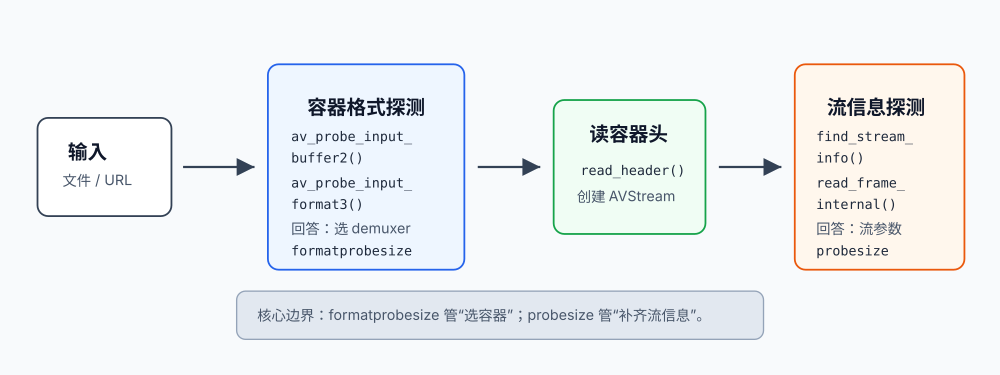
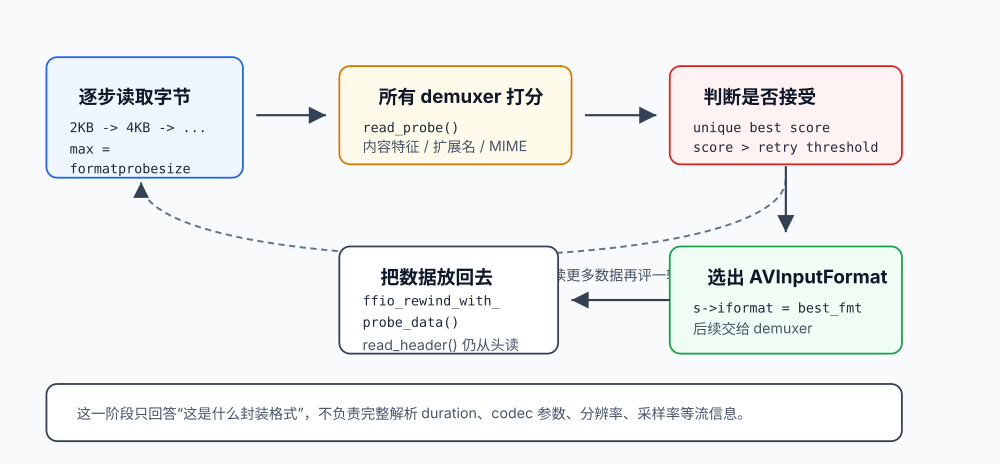
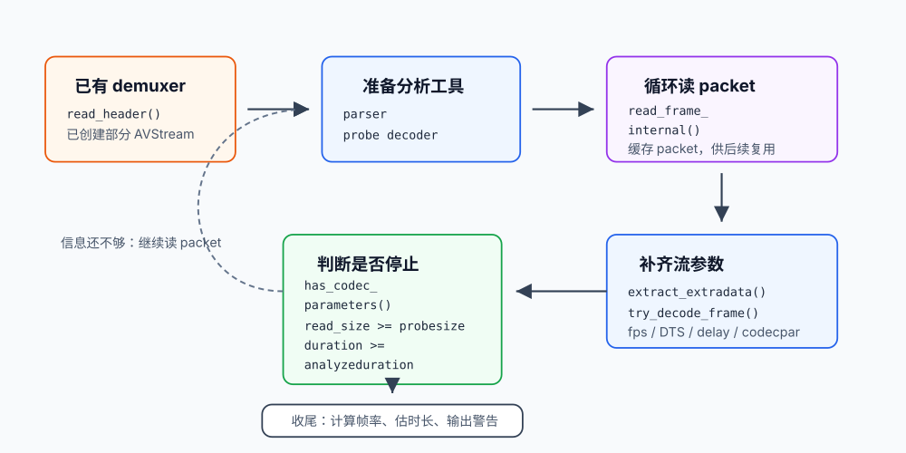

# 别再混淆 formatprobesize 和 probesize：FFmpeg Probe 机制源码解析

> FFmpeg 的 probe 不是一个单点动作，而是两个阶段：先识别“这是什么封装容器”，再补齐“容器里的流信息”。`formatprobesize` 和 `probesize` 名字很像，但它们控制的是两条不同路径。

一句 `ffmpeg -i input.xxx`，或者一行 `avformat_open_input(&ctx, url, NULL, NULL)`，FFmpeg 就能从几百种封装格式里选出一个 demuxer。真正容易混淆的是：选 demuxer 的 **封装容器 probe**，和后面补齐 `AVStream` / codec 参数的 **流信息 probe**，经常都被口头叫成 probe。

这篇文章按“总分”结构拆开讲：

```text
总：先看封装容器 probe 和流信息 probe 的边界
分：再分别展开两个阶段的源码路径、退出条件和调优参数
```



---

## 1. 先把两个 probe 分清楚

FFmpeg 打开输入时，至少有两个容易被混在一起的探测阶段。

| 阶段 | 主要问题 | 关键函数 | 控制参数 | 典型输出 |
|---|---|---|---|---|
| 封装容器 probe | 这段输入最像哪种容器格式？ | `av_probe_input_buffer2()` / `av_probe_input_format3()` | `formatprobesize` / `format_probesize` | `AVInputFormat`，也就是选中 demuxer |
| 流信息 probe | 选好 demuxer 后，每路流的参数够不够？ | `avformat_find_stream_info()` | `probesize` / `probesize`，还受 `analyzeduration` 等限制 | `AVStream`、`AVCodecParameters`、帧率、extradata、duration 估计等 |

放到调用链里看：

```text
avformat_open_input()
  -> init_input()
     -> av_probe_input_buffer2(..., s->format_probesize)
        -> av_probe_input_format2()
           -> av_probe_input_format3()
              -> 选择 AVInputFormat
  -> demuxer->read_header()

avformat_find_stream_info()
  -> read_frame_internal()
  -> parser / codec probe / extradata extraction / try_decode_frame()
  -> 补齐 stream info
```

注意一个 API 层面的细节：`avformat_find_stream_info()` 不是 `avformat_open_input()` 内部自动调用的固定步骤。命令行工具 `ffmpeg` / `ffprobe` 默认会在打开输入后调用它；如果你直接使用 libavformat C API，需要自己决定是否调用。

两个参数的边界可以先记成一句话：

> `formatprobesize` 管“选哪个 demuxer”；`probesize` 管“选好 demuxer 后，为了补齐流信息还能继续读多少”。

严格说，`AVFormatContext.probesize` 的源码注释是“为了确定 stream properties 最多读多少字节”，并且会用于 reading global header 和 `avformat_find_stream_info()`。所以个别 demuxer 在 `read_header()` 或内部同步/扫描时也可能参考它；但它仍然不是用来选择顶层 `AVInputFormat` 的。选择容器格式的上限是 `format_probesize`。

命令行里也应该按目标分别调：

```bash
# 容器格式识别慢或误判：调 formatprobesize
ffmpeg -formatprobesize 65536 -i input.xxx

# demuxer 已选对，但流参数不完整：调 probesize / analyzeduration
ffmpeg -probesize 5000000 -analyzeduration 5000000 -i input.xxx
```

C API 里可以通过 AVOption 设置：

```c
AVDictionary *opts = NULL;
av_dict_set(&opts, "formatprobesize", "65536", 0);
av_dict_set(&opts, "probesize", "5000000", 0);

avformat_open_input(&ctx, url, NULL, &opts);
avformat_find_stream_info(ctx, NULL);
```

---

## 2. 封装容器 probe：选择 AVInputFormat

封装容器 probe 的职责很窄：回答“这段输入数据，应该交给哪个 demuxer 解析？”

可以先粗暴理解成：

```text
probe = 选择 AVInputFormat，也就是选择 demuxer
demux = 由选中的 demuxer 执行 read_header / read_packet
```

如果用户已经显式指定输入格式，比如命令行 `-f flv`，或者 C API 传入 `av_find_input_format("flv")` 的结果，FFmpeg 就会信任用户指定的 demuxer，不再走完整的自动识别流程。

### 2.1 主调用链

封装容器 probe 的主线是三层函数：

```text
av_probe_input_buffer2()
  -> av_probe_input_format2()
     -> av_probe_input_format3()
```

它们的分工如下：

| 函数 | 作用 |
|---|---|
| `av_probe_input_buffer2()` | 外层驱动：逐步读取更多输入数据，控制 probe buffer 增长 |
| `av_probe_input_format2()` | 中间层：只有当新一轮得分超过当前阈值时才返回格式 |
| `av_probe_input_format3()` | 内层评分：遍历所有 demuxer，计算每个 demuxer 的匹配分数 |

真正“哪个 demuxer 更像”的判断，主要在 `av_probe_input_format3()`；而“要不要继续多读一点数据”，主要在 `av_probe_input_buffer2()`。



### 2.2 Probe buffer 是逐步翻倍的

入口函数位于：

```text
libavformat/format.c
```

核心签名是：

```c
int av_probe_input_buffer2(AVIOContext *pb,
                           const AVInputFormat **fmt,
                           const char *filename,
                           void *logctx,
                           unsigned int offset,
                           unsigned int max_probe_size);
```

如果调用者没有传 `max_probe_size`，FFmpeg 使用默认最大值：

```c
#define PROBE_BUF_MIN 2048
#define PROBE_BUF_MAX (1 << 20)
```

也就是：

```text
最小 probe size：2 KB
默认最大 probe size：1 MiB
```

源码里的循环可以简化成：

```c
for (probe_size = PROBE_BUF_MIN;
     probe_size <= max_probe_size && !*fmt && !eof;
     probe_size = FFMIN(probe_size << 1,
                        FFMAX(max_probe_size, probe_size + 1))) {
    ...
}
```

直观理解就是：

```text
2048 -> 4096 -> 8192 -> 16384 -> ...
```

每一轮不是从头重读，而是继续补齐到当前目标大小：

```c
avio_read(pb, buf + buf_offset, probe_size - buf_offset);
```

其中：

```text
buf_offset：已经累计读取的字节数
probe_size：这一轮希望凑够的探测字节数
```

这对网络流尤其重要：一开始数据少，就先用少量数据尝试；识别不出来，再继续读更多。

### 2.3 每一轮都有接受门槛

FFmpeg 不会只要某个 demuxer 有一点点分数就立刻接受。每轮调用 `av_probe_input_format2()` 前，会先设置一个门槛：

```c
score = probe_size < max_probe_size ? AVPROBE_SCORE_RETRY : 0;
```

相关宏：

```c
#define AVPROBE_SCORE_MAX   100
#define AVPROBE_SCORE_RETRY (AVPROBE_SCORE_MAX / 4)
```

也就是：

```text
AVPROBE_SCORE_MAX   = 100
AVPROBE_SCORE_RETRY = 25
```

含义是：

```text
还没读到最大 probe size 时：
  只有 best_score > 25，才接受结果

已经读到最大 probe size，或者遇到 EOF 时：
  门槛降为 0，只要 best_score > 0，就可能接受
```

这套机制的目的很现实：前几 KB 可能只有 padding、ID3 标签、HTTP 前置数据，或者格式特征还没出现。低分候选先别急着信，继续读一点再判断。

如果最终只能低分识别，FFmpeg 会打印类似这样的警告：

```text
Format xxx detected only with low score of yy, misdetection possible!
```

这就是排查奇怪输入时偶尔会看到的 “low score” 提示。

### 2.4 单个 demuxer 怎么打分？

`av_probe_input_format3()` 会遍历所有已注册的 demuxer：

```c
while ((fmt1 = av_demuxer_iterate(&i))) {
    ...
}
```

每个 demuxer 都有一次“自我证明”的机会。分数主要来自三类信号。

第一类是内容特征，也就是 demuxer 自己实现的 `read_probe()`：

```c
score = ffifmt(fmt1)->read_probe(&lpd);
```

`read_probe()` 会看输入 buffer 的内容特征，比如：

```text
MP4/MOV：检查 box / atom 结构，例如 ftyp、moov、mdat
MPEG-TS：检查 0x47 sync byte 是否按固定间隔出现
HLS：检查 #EXTM3U、#EXT-X-xxx 标签
WAV：检查 RIFF/WAVE 结构
Matroska/WebM：检查 EBML 头
```

这是最可靠的信号，因为它看的是文件内容，而不是文件名。

第二类是扩展名。这里有一个容易写错的细节：

```c
if (fmt1->read_probe) {
    score = read_probe(...);

    if (fmt1->extensions && av_match_ext(filename, fmt1->extensions))
        score = FFMAX(score, 1);
} else if (fmt1->extensions) {
    if (av_match_ext(filename, fmt1->extensions))
        score = AVPROBE_SCORE_EXTENSION;
}
```

也就是说：

- 如果 demuxer 有 `read_probe()`，扩展名匹配通常只是把分数至少抬到 `1`；
- 如果 demuxer 没有 `read_probe()`，扩展名匹配才会给 `AVPROBE_SCORE_EXTENSION`；
- 遇到 ID3v2 标签特别长的情况，源码里还有额外保护逻辑，会调整扩展名相关分数，避免前面全是 ID3 导致内容探测失败。

所以不要简单写成“扩展名匹配一律给 50 分”。更准确的说法是：

> 内容探测优先；扩展名是辅助信号；只有没有 `read_probe()`，或者遇到特定 ID3 场景时，扩展名才会发挥更强的兜底作用。

第三类是 MIME type。对于网络输入，如果 AVIO 层能拿到 HTTP `Content-Type` 这类信息，FFmpeg 还会做 MIME 匹配：

```c
if (av_match_name(lpd.mime_type, fmt1->mime_type)) {
    score += AVPROBE_SCORE_MIME_BONUS;
    score = FFMIN(score, AVPROBE_SCORE_MAX);
}
```

相关宏：

```c
#define AVPROBE_SCORE_MIME_BONUS 30
#define AVPROBE_SCORE_MAX        100
```

所以 MIME type 是加分项，最多把分数封顶到 100。

### 2.5 所有 demuxer 怎么决出冠军？

单个 demuxer 打完分后，FFmpeg 会维护当前最高分：

```c
if (score > score_max) {
    score_max = score;
    fmt       = fmt1;
} else if (score == score_max) {
    fmt = NULL;
}
```

这段逻辑非常关键：

```text
分数更高：更新当前最佳 demuxer
分数打平：fmt = NULL
```

也就是说，FFmpeg 不会在最高分打平时随便挑一个。它要求“唯一最高分”。

为什么这么设计？

因为错选 demuxer 的代价很高。容器格式一旦选错，后面的 `read_header()`、`read_packet()` 都可能走偏，轻则报错，重则误解析。与其瞎猜，不如让外层继续多读一点数据，再跑一轮评分。

可以把内层选择过程写成伪代码：

```c
best_fmt = NULL;
best_score = 0;

for_each_demuxer(fmt) {
    score = probe_one_demuxer(fmt, data, filename, mime_type);

    if (score > best_score) {
        best_score = score;
        best_fmt = fmt;
    } else if (score == best_score) {
        best_fmt = NULL;
    }
}

return best_fmt, best_score;
```

最终只有满足：

```text
best_fmt != NULL
best_score > 当前门槛
```

外层才会接受这个 demuxer。

### 2.6 探测读过的数据会丢吗？

不会。

`av_probe_input_buffer2()` 读了一段数据用于判断格式，但结束前会调用：

```c
ffio_rewind_with_probe_data(pb, &buf, buf_offset);
```

它的作用是把 probe 阶段读出来的数据“塞回去”，让后续 demuxer 仍然可以从输入开头开始读。

这对不可 seek 的输入很重要。比如网络流不能像本地文件那样随便 `seek(0)`，FFmpeg 就通过复用 probe buffer 的方式实现“逻辑上的 rewind”。

所以流程是：

```text
probe 阶段读了一些字节
  -> 根据这些字节选出 demuxer
  -> 把已读字节放回 AVIOContext
  -> demuxer->read_header() 仍然能读到开头数据
```

### 2.7 什么时候调 formatprobesize？

`formatprobesize` 只应该围绕“容器格式识别”这个目标调。

```text
想更快选出 demuxer、降低格式识别等待：
  可以尝试调小 formatprobesize

输入头部很长、前面有大段 ID3 / padding / 私有数据，导致格式识别失败：
  可以尝试调大 formatprobesize

已经显式指定 iformat，例如 -f flv：
  format probe 基本不会按自动识别流程执行，调 formatprobesize 意义不大
```

但不要把它当成“补齐分辨率、采样率、帧率”的参数。那些是下一阶段的事。

---

## 3. 流信息 probe：补齐 AVStream 和 codec 参数

容器格式 probe 结束后，FFmpeg 只是知道“应该用哪个 demuxer”。接下来 `demuxer->read_header()` 会解析容器头，创建 `AVStream`，填一部分 `codecpar`、time base、duration、metadata 等信息。

但很多输入的头部信息并不完整：

```text
MPEG-TS 这类流式封装，节目和流信息可能要等 PAT / PMT 出现
H.264 / HEVC 的宽高、profile、extradata 可能要等 SPS / VPS / PPS
音频采样率、声道布局、sample format 有时要看帧头或解码器初始化结果
帧率、B 帧 delay、first DTS 往往要观察多个 packet
```

这就是 `avformat_find_stream_info()` 要补的东西。它不再负责选择容器格式，而是在已选 demuxer 的基础上继续读包、解析、必要时轻量解码，直到“信息足够”或者达到限制。



### 3.1 先准备 parser 和临时 decoder

函数入口在：

```text
libavformat/demux.c
  avformat_find_stream_info()
```

它一开始会遍历已有 `AVStream`，做几类准备：

```text
如果 stream 需要 parsing：
  av_parser_init(st->codecpar->codec_id)

把 AVCodecParameters 拷到内部 AVCodecContext：
  avcodec_parameters_to_context(sti->avctx, st->codecpar)

查找 probe 用 decoder：
  find_probe_decoder()

如果已有参数还不够，或者是字幕流：
  尝试 avcodec_open2()
```

这里的 decoder 主要是为了探测参数，不是正式播放或转码的解码链路。源码里还会强制设置 `threads=1`，因为某些 decoder 在多线程下不一定能及时把 SPS/PPS 这类信息提取到 extradata。

### 3.2 什么叫“流信息已经够了”？

核心判断之一是 `has_codec_parameters()`。

它会根据媒体类型检查基本参数是否已经齐全：

```text
通用：
  codec_id 不能未知，data 流除外

audio：
  sample_rate 要有
  channel layout / channel count 要有
  sample_fmt 在 decoder 可用时要有
  某些 codec 还要求 frame_size 或可解码帧

video：
  width / height 要有
  pix_fmt 在 decoder 可用时要有
  某些 RealVideo 场景还要至少看到帧或 SAR

subtitle：
  部分字幕格式也要补 size
```

主循环里还会额外判断一些“只靠 codecpar 不够”的信息：

```text
视频帧率是否需要更多帧来估算
是否已经看到足够的 DTS / PTS
是否有 B 帧 delay 证据
是否还缺 extradata
是否还没拿到 first DTS
```

所以 `avformat_find_stream_info()` 的目标不是“多读一点就结束”，而是“读到足够判断各路流参数为止”。

### 3.3 主循环：读包、分析、缓存，再决定是否继续

核心循环可以简化成这样：

```c
read_size = 0;

for (;;) {
    if (all_streams_have_enough_info && !no_header_format)
        break;

    if (read_size >= ic->probesize)
        break;

    ret = read_frame_internal(ic, pkt);
    if (ret < 0) {
        eof_reached = 1;
        break;
    }

    if (!(ic->flags & AVFMT_FLAG_NOBUFFER))
        packet_buffer_push(pkt);

    if (!attached_pic)
        read_size += pkt->size;

    update_dts_and_fps_statistics(pkt);
    extract_extradata_if_needed(pkt);
    try_decode_frame_if_needed(pkt);

    if (analyzed_duration_reaches_limit)
        break;
}
```

几个关键点：

- `read_size` 是按 packet size 累加的字节数，不是 format probe 的 buffer 大小。
- 达到 `ic->probesize` 后会打印 `Probe buffer size limit ... reached`，然后退出继续收尾。
- 读到的 packet 默认会放进 `packet_buffer`，后续 `av_read_frame()` 还能吐出来；这和 format probe 阶段通过 `ffio_rewind_with_probe_data()` 把字节塞回去是两套机制。
- 对 `AVFMTCTX_NOHEADER` 这类没有完整头部的格式，即使一度看起来信息够了，也可能继续读，因为新 stream 可能在后续 packet 中才出现。

### 3.4 probesize 是字节限制，analyzeduration 是时间限制

流信息探测至少有两类常见退出条件：

```text
字节维度：
  read_size >= ic->probesize

媒体时间维度：
  已分析 packet 覆盖的时间 >= ic->max_analyze_duration
```

`probesize` 的默认值在 `libavformat/options_table.h` 里：

```c
{"probesize", "set probing size", OFFSET(probesize),
 AV_OPT_TYPE_INT64, {.i64 = 5000000 }, 32, (double)INT64_MAX, D},
```

`analyzeduration` 的 option 默认值是 0，但 0 代表让 `avformat_find_stream_info()` 选启发式默认值。当前代码里常见默认是：

```text
普通流：5 秒
字幕流：30 秒
FLV：流分析上限可放到 90 秒
MPEG / MPEG-TS：流分析上限是 7 秒
```

这也是为什么 FFmpeg 的警告通常会同时提示两个参数：

```text
Consider increasing the value for the 'analyzeduration' and 'probesize' options
```

因为一个限制“最多读多少字节”，另一个限制“最多分析多长媒体时间”。码率很高时可能先撞 `probesize`，低码率或稀疏流可能先撞 `analyzeduration`。

### 3.5 还有几个名字相近的限制

除了 `formatprobesize` 和 `probesize`，还有几个选项也容易混进来。

| 参数 | 控制对象 |
|---|---|
| `analyzeduration` | `avformat_find_stream_info()` 最多分析多少媒体时间，单位是微秒 |
| `fpsprobesize` | 为估算 fps 最多看多少帧；默认 `-1` 表示走内部启发式 |
| `max_probe_packets` | 每路 stream 做 codec probe 时最多缓存多少个 packet，默认 2500 |
| `duration_probesize` | 在 `estimate_timings_from_pts()` 为估算总时长读取文件尾部 PTS 的字节上限，主要影响 MPEG-PS / MPEG-TS |

其中 `duration_probesize` 不是用来识别容器，也不是用来补 codec 参数的。它发生在 `avformat_find_stream_info()` 后段的 duration 估算逻辑里，典型场景是可 seek 的 MPEG-PS / MPEG-TS 文件需要读尾部 PTS 来估总时长。

另一个容易忽略的点是 codec probe。`demux.c` 里有 `probe_codec()`，当某路 stream 的 codec 还需要探测时，它会把该 stream 的 packet 拼进 `AVProbeData`，再调用 `set_codec_from_probe_data()`。这个过程内部也会用到 `av_probe_input_format3()` 的打分逻辑，但它是在“已选 demuxer 之后”用来识别 elementary stream / codec，不是顶层容器 format probe。

这个 codec probe 的结束条件也会看：

```c
raw_packet_buffer_size >= s->probesize
sti->probe_packets <= 0
```

所以看到 `av_probe_input_format3()` 不一定就是在选容器；要看它处在哪条调用链上。

### 3.6 什么时候调 probesize？

`probesize` 适合解决“demuxer 已经选对，但流参数还没探出来”的问题。

典型信号包括：

```text
Could not find codec parameters for stream ...
not enough frames to estimate rate; consider increasing probesize
音频采样率 / 声道数没拿到
视频宽高 / pix_fmt / extradata 没拿到
帧率估算明显不准
```

这种情况下通常不能只看 `probesize`，还要一起看 `analyzeduration`。字节上限和媒体时间上限任何一个先撞到，都可能提前结束分析。

---

## 4. 把两段流程合起来看

顶层容器格式探测，也就是 `formatprobesize` 控制的部分，可以压缩成：

```c
int av_probe_input_buffer2(pb, &fmt, filename, logctx, offset, max_probe_size) {
    if (max_probe_size == 0)
        max_probe_size = PROBE_BUF_MAX;

    for (probe_size = PROBE_BUF_MIN;
         probe_size <= max_probe_size && !fmt && !eof;
         probe_size *= 2) {

        read_more_until_probe_size();
        score_threshold = probe_size < max_probe_size ? AVPROBE_SCORE_RETRY : 0;

        fmt = av_probe_input_format2(&probe_data, 1, &score_threshold);
        if (fmt)
            break;
    }

    ffio_rewind_with_probe_data(pb, &buf, buf_offset);
    return fmt ? score : AVERROR_INVALIDDATA;
}
```

流信息探测，也就是 `probesize` 控制的部分，可以压缩成：

```c
int avformat_find_stream_info(AVFormatContext *ic, AVDictionary **options) {
    probesize = ic->probesize;
    max_analyze_duration = choose_analyze_duration(ic);

    init_parsers_and_probe_decoders(ic);

    read_size = 0;
    for (;;) {
        if (all_streams_have_enough_info(ic) && !format_has_no_header(ic))
            break;

        if (read_size >= probesize)
            break;

        ret = read_frame_internal(ic, pkt);
        if (ret < 0)
            break;

        buffer_packet_for_later_av_read_frame(pkt);

        if (!attached_pic(pkt))
            read_size += pkt->size;

        update_timestamps_duration_and_fps_guess(pkt);
        extract_extradata_if_missing(pkt);
        try_decode_frame_if_needed(pkt);

        if (analyzed_duration_reaches_limit(ic, max_analyze_duration))
            break;
    }

    flush_probe_decoders_if_needed(ic);
    calculate_frame_rates(ic);
    estimate_timings(ic);
    warn_if_codec_parameters_still_missing(ic);
}
```

这两段伪代码放在一起看，边界就很清楚：

```text
formatprobesize：
  控制 av_probe_input_buffer2() 为了选择 demuxer 最多读多少字节

probesize：
  控制 avformat_find_stream_info() 为了补齐流信息最多读多少 packet 数据
```

---

## 5. 常见误区和调优建议

### 5.1 format probe 不负责完整媒体信息

封装容器 probe 通常不负责最终确定：

```text
duration
stream 数量
codec 参数
分辨率
采样率
time_base
extradata
```

这些信息更多发生在后续阶段：

```text
demuxer->read_header()
avformat_find_stream_info()
read_packet()
parser / codec probing
duration estimation
```

举几个例子：

```text
MP4 的 duration 通常来自 read_header() 解析 moov box
TS 的节目和流信息通常来自 PAT / PMT 解析
H.264 / HEVC 的 extradata 可能来自 parser、bitstream filter 或 decoder
视频平均帧率可能要 avformat_find_stream_info() 观察多帧后估算
MPEG-TS 的总时长可能要 estimate_timings_from_pts() seek 到尾部估算
```

### 5.2 参数应该按问题类型调

| 现象 | 优先考虑 |
|---|---|
| 没指定 `-f` 时格式识别慢 | 调小 `formatprobesize`，但要接受误判风险 |
| 头部很长、前面有大段 ID3 / padding，导致格式识别失败 | 调大 `formatprobesize` |
| 已指定 `-f` 或调用方已设置 `iformat` | `formatprobesize` 基本无意义 |
| 报 codec parameters 不完整 | 调 `probesize`，同时看 `analyzeduration` |
| 帧率估不准 | 看 `probesize`、`analyzeduration`、`fpsprobesize` |
| MPEG-TS / MPEG-PS 文件时长估算不准 | 看 `duration_probesize` 和是否允许 seek 到尾部 |

### 5.3 点播 / 直播首帧优化里怎么设置？

先给结论：首帧优化不是把 `formatprobesize` 和 `probesize` 都改小。

`formatprobesize` 只影响“自动识别容器格式”这一步。很多点播和直播输入其实已经通过 URL、扩展名、协议、manifest、SDP 或用户指定的 `-f` 明确了格式，首帧耗时通常不在这里，而是在：

```text
网络建连 / 拉流缓冲
demuxer->read_header()
avformat_find_stream_info()
等待关键帧 / GOP
解码器初始化
渲染首帧
```

所以首帧优化更常见的调参对象是 `probesize`、`analyzeduration`、`fflags=nobuffer`、协议传输方式，以及业务侧的 GOP / 关键帧策略。

调研到的真实案例可以分成两类：

- FFmpeg 官方文档明确说，`probesize` 越大越容易探到分散在流里的信息，但会增加延迟；`analyzeduration` 越大信息越准确，也会增加延迟；`fflags nobuffer` 用来减少初始输入流分析阶段引入的缓冲。参考：[FFmpeg Formats Documentation](https://ffmpeg.org/ffmpeg-formats.html)。
- RTSP / 摄像头低延迟场景里，社区和厂商文档经常会把 `-probesize 32`、`-analyzeduration 0`、`-fflags nobuffer` 组合使用。比如 StackOverflow 的低延迟 ffplay 答案、Exvist HDMI encoder 文档，以及 homebridge-camera-ffmpeg 的 issue 都给过类似经验配置。参考：[StackOverflow 低延迟 ffplay 讨论](https://stackoverflow.com/questions/16658873/how-to-minimize-the-delay-in-a-live-streaming-with-ffmpeg)、[Exvist RTSP 低延迟示例](https://support.exvist.com/portal/en/kb/hdmi-encoder/faqs/network/articles/faqs-encoder-reduce-latency-with-ffplay)、[homebridge-camera-ffmpeg #1257](https://github.com/homebridge-plugins/homebridge-camera-ffmpeg/issues/1257)。
- 媒体服务器 / 点播转码场景往往会反过来把值设得更大，优先保证流识别稳定。Jellyfin 文档里的默认配置就是 `FFmpeg:probesize = "1G"`、`FFmpeg:analyzeduration = "200M"`；但 Live TV 场景又有人把 `probesize` 降到 `8M` 来缩短直播启动。参考：[Jellyfin 配置文档](https://jellyfin.org/docs/general/administration/configuration/)、[Jellyfin Live TV 调优案例](https://www.hitoha.moe/fix-jellyfin-live-tv/)。

这些案例说明的是同一件事：低延迟和信息完整度是 trade-off，不存在一个对所有输入都正确的魔法值。

点播场景可以按这个思路设置：

| 场景 | 建议 |
|---|---|
| 普通 MP4 / FLV / HLS 点播，源可控，头部信息完整 | `formatprobesize` 通常保持默认；`probesize` 可以从 `1M` 到默认 `5M` 之间试，`analyzeduration` 可从 `500000` 到 `2000000` 微秒试 |
| 用户上传、容器复杂、字幕 / 多音轨 / 私有数据多 | 不建议激进降低 `probesize`；优先保持默认，甚至按业务需要调大 |
| 已知格式并且格式识别本身慢 | 先显式指定 `-f` 或调用方设置 `iformat`；只有确实走自动识别且卡在 format probe 时，再考虑 `formatprobesize` |

示例：

```bash
# 受控点播源：减少流信息分析预算，但不要直接压到极限
ffmpeg -probesize 1M -analyzeduration 1000000 -i input.mp4 ...
```

直播 / RTSP / 摄像头场景可以更激进，但要分层验证：

| 场景 | 建议 |
|---|---|
| 已知稳定的单视频流或简单音视频流 | `probesize` 可以从 `32K`、`256K`、`512K` 逐档试；`analyzeduration` 可以用较小正数，例如 `100000` 到 `500000` 微秒 |
| 为了快速验证最低启动延迟 | 可以试社区常见的 `-probesize 32` 组合，但只把它当压测下限，不要默认上线 |
| 出现音频爆音、音画不同步、宽高 / 采样率拿不到、codec parameters 不完整 | 逐步增大 `probesize` 和 `analyzeduration`，不要继续压低 |
| 网络有抖动或丢包 | `-fflags nobuffer`、UDP、`-framedrop` 可能反而导致不稳定，需要和 TCP / 更保守缓冲对比 |

示例：

```bash
# 极限直播测试：只适合已知稳定输入，用来观察首帧下限
ffplay -rtsp_transport udp -fflags nobuffer \
  -probesize 32 -analyzeduration 0 -flags low_delay \
  rtsp://example.com/live

# 更稳妥的直播起点：仍然降低分析预算，但保留一定流信息探测空间
ffplay -rtsp_transport tcp -fflags nobuffer \
  -probesize 262144 -analyzeduration 500000 \
  rtsp://example.com/live
```

这里还有一个源码层面的细节：当前 FFmpeg 源码里，`analyzeduration` 这个 AVOption 默认值是 `0`，而 `avformat_find_stream_info()` 看到 `max_analyze_duration == 0` 时会选择内部默认值，比如常见的 5 秒、字幕 30 秒、MPEG / MPEG-TS 7 秒等。也就是说，网上很多命令里的 `-analyzeduration 0` 是真实案例里常见的写法，但在分析当前版本行为时，不要想当然把它理解成“完全不分析”。更稳的做法是：

```text
先用业务候选值跑一遍
打开 -loglevel verbose 或 debug
看是否出现 max_analyze_duration reached
看是否出现 codec parameters 不完整、fps 估算不足等警告
再决定继续降低还是回调
```

如果要给一个可执行的经验规则：

```text
formatprobesize：
  首帧优化里通常不先动它
  只有“自动容器识别”确实是瓶颈时才调

probesize：
  点播优先稳，通常 1M 到默认 5M 起步
  直播可以更小，但从 32K / 256K / 512K 逐档试
  -probesize 32 是极限测试值，不是通用生产值

analyzeduration：
  和 probesize 一起看
  低延迟直播可以尝试较小正数
  发现参数不完整或同步问题就回调
```

最后别忘了，首帧不是 probe 一个因素决定的。实际线上优化还要同时看 GOP 长度、是否能快速拿到关键帧、服务端是否支持低延迟输出、网络传输策略、播放器队列和解码器冷启动。Probe 参数只是“打开输入阶段”的一组旋钮。

### 5.4 一句话总结

FFmpeg 的输入探测可以分成两个层次：

```text
第一层：容器格式识别
  渐进读取输入字节
  遍历 demuxer 打分
  选择唯一最高分
  受 formatprobesize 控制

第二层：流信息补齐
  基于已选 demuxer 继续读 packet
  配合 parser / decoder / extradata 提取
  判断 codecpar、fps、DTS、duration 等是否足够
  受 probesize、analyzeduration 等控制
```

这也是 `formatprobesize` 和 `probesize` 最容易混淆、但又必须拆开理解的原因。

---

## 源码索引

建议阅读这些文件和函数：

```text
libavformat/format.c
  - av_probe_input_buffer2()
  - av_probe_input_format2()
  - av_probe_input_format3()

libavformat/demux.c
  - avformat_open_input()
  - init_input()
  - avformat_find_stream_info()
  - has_codec_parameters()
  - try_decode_frame()
  - extract_extradata()
  - probe_codec()
  - estimate_timings()
  - estimate_timings_from_pts()

libavformat/internal.h
  - PROBE_BUF_MIN
  - PROBE_BUF_MAX

libavformat/avformat.h
  - AVProbeData
  - AVPROBE_SCORE_*
  - AVInputFormat / read_probe
  - AVFormatContext.format_probesize
  - AVFormatContext.probesize
  - AVFormatContext.max_analyze_duration
  - AVFormatContext.duration_probesize

libavformat/options_table.h
  - formatprobesize
  - probesize
  - analyzeduration
  - fpsprobesize
  - max_probe_packets
  - duration_probesize
```
