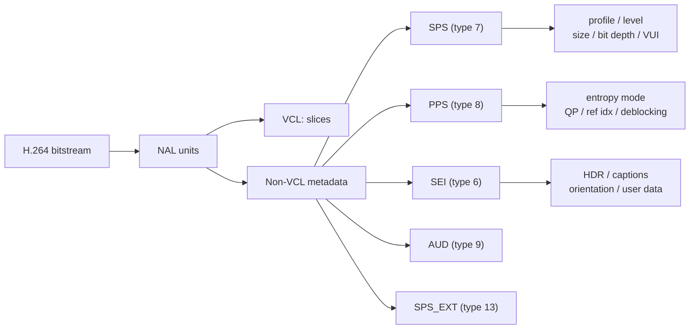
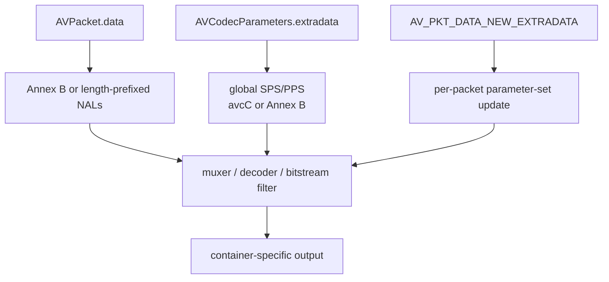
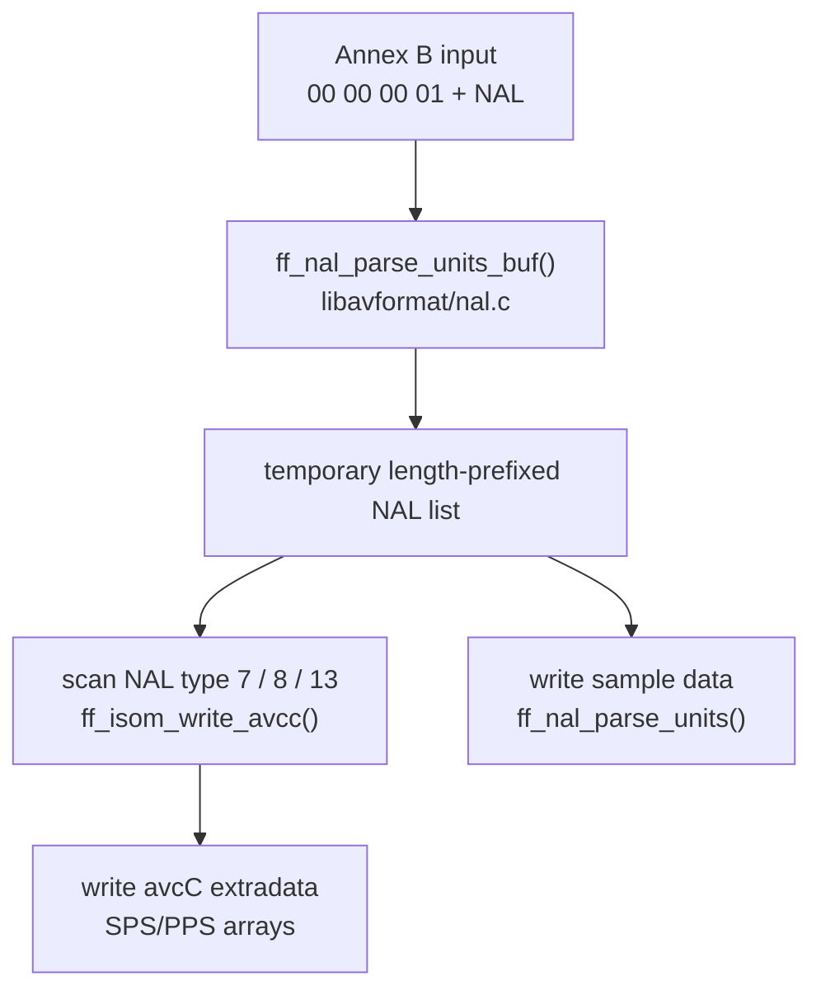
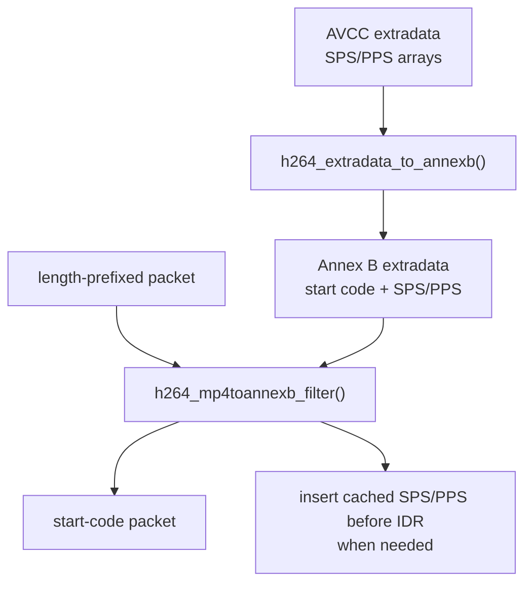
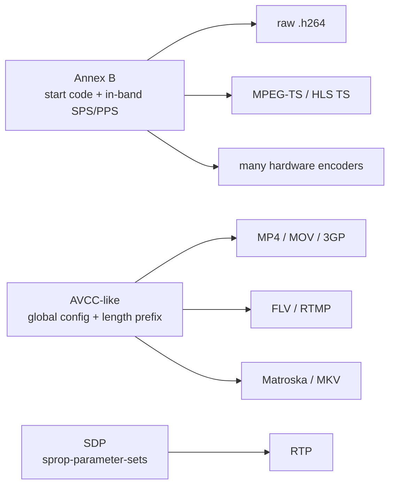

# H.264 元数据：SPS/PPS/SEI、AVCC 与 Annex B

在 H.264 里说“元数据”，通常不是指容器层的 title、artist、creation_time
这类标签，而是指 **解码器解释 H.264 视频码流所需的参数和辅助信息**。这些信息
大多以 NAL unit 存在，其中最关键的是：

- `SPS`：Sequence Parameter Set，NAL type 7。
- `PPS`：Picture Parameter Set，NAL type 8。
- `SEI`：Supplemental Enhancement Information，NAL type 6。
- `AUD`：Access Unit Delimiter，NAL type 9。
- `SPS_EXT`：SPS extension，NAL type 13，高规格 profile 可能出现。

FFmpeg 在 `libavcodec/h264.h:33` 定义了这些 H.264 NAL 类型。理解这些元数据
在不同封装里的保存方式，是排查“MP4 提取出 H.264 后不能播放”“TS 转 MP4
缺 extradata”“播放器首帧黑屏或花屏”的基础。

本文聚焦两个最常见的存在形式：

- **Annex B**：NAL 之间用 start code 分隔，SPS/PPS 通常在码流内出现。
- **AVCC / AVCDecoderConfigurationRecord**：SPS/PPS 放在容器全局配置里，样本内
  NAL 用长度前缀分隔。

所有 FFmpeg 源码定位均基于当前仓库代码。

先用一张图建立整体关系：H.264 的解码数据和元数据都以 NAL unit 为基本单位，
但只有一部分 NAL 承载“如何解释后续图像”的参数。



---

## 1. H.264 元数据包含哪些内容？

### 1.1 NAL 类型层面的元数据

H.264 码流由一组 NAL unit 组成。FFmpeg 的核心枚举在 `libavcodec/h264.h:33`：

| NAL type | 名称 | 作用 |
| ---: | --- | --- |
| 1 | `H264_NAL_SLICE` | 非 IDR slice 数据 |
| 5 | `H264_NAL_IDR_SLICE` | IDR slice 数据，随机访问点 |
| 6 | `H264_NAL_SEI` | 补充增强信息 |
| 7 | `H264_NAL_SPS` | 序列级参数 |
| 8 | `H264_NAL_PPS` | 图像级参数 |
| 9 | `H264_NAL_AUD` | Access Unit Delimiter |
| 12 | `H264_NAL_FILLER_DATA` | filler |
| 13 | `H264_NAL_SPS_EXT` | SPS extension |

其中真正决定解码配置的是 SPS 和 PPS；SEI 更多是辅助显示、HDR、字幕、用户数据等；
AUD 用于访问单元边界标识，不是解码参数。

### 1.2 SPS：序列级参数

SPS 描述一段 H.264 序列的全局能力和图像结构。FFmpeg 有两套相关结构：

- CBS 原始语法结构：`H264RawSPS`，见 `libavcodec/cbs_h264.h:102`。
- 解码器内部整理后的结构：`SPS`，见 `libavcodec/h264_ps.h:44`。

SPS 中常见内容包括：

| 类别 | 典型字段 | FFmpeg 源码 |
| --- | --- | --- |
| Profile/level | `profile_idc`、constraint flags、`level_idc` | `libavcodec/cbs_h264.h:105` |
| 色度与位深 | `chroma_format_idc`、`bit_depth_luma_minus8`、`bit_depth_chroma_minus8` | `libavcodec/cbs_h264.h:117` |
| POC/帧号 | `log2_max_frame_num_minus4`、`pic_order_cnt_type`、`log2_max_pic_order_cnt_lsb_minus4` | `libavcodec/cbs_h264.h:128` |
| 参考帧 | `max_num_ref_frames`、`gaps_in_frame_num_allowed_flag` | `libavcodec/cbs_h264.h:137` |
| 尺寸 | `pic_width_in_mbs_minus1`、`pic_height_in_map_units_minus1` | `libavcodec/cbs_h264.h:140` |
| 场/帧编码 | `frame_mbs_only_flag`、`mb_adaptive_frame_field_flag` | `libavcodec/cbs_h264.h:143` |
| 裁剪 | `frame_cropping_flag`、`frame_crop_*_offset` | `libavcodec/cbs_h264.h:147` |
| VUI | SAR、overscan、色彩、chroma location、timing、HRD、bitstream restriction | `libavcodec/cbs_h264.h:58` |
| scaling matrix | `seq_scaling_matrix_present_flag`、4x4/8x8 scaling list | `libavcodec/cbs_h264.h:123` |

VUI 是 SPS 中最像“媒体元数据”的部分。FFmpeg 的 `H264RawVUI`
覆盖了 SAR、色彩描述、时基、HRD 和 bitstream restriction，定义在
`libavcodec/cbs_h264.h:58`。解码器内部的通用 VUI 结构 `H2645VUI`
则在 `libavcodec/h2645_vui.h:27`，其中包括：

- `sar` / `aspect_ratio_idc`
- `video_format`
- `video_full_range_flag`
- `colour_primaries`
- `transfer_characteristics`
- `matrix_coeffs`
- `chroma_sample_loc_type_top_field`
- `chroma_sample_loc_type_bottom_field`

### 1.3 PPS：图像级参数

PPS 依赖某个 SPS，描述 picture/slice 级别的编码工具配置。CBS 原始结构
`H264RawPPS` 在 `libavcodec/cbs_h264.h:171`，解码器内部 `PPS`
在 `libavcodec/h264_ps.h:110`。

PPS 主要包含：

| 类别 | 典型字段 | FFmpeg 源码 |
| --- | --- | --- |
| 参数集关联 | `pic_parameter_set_id`、`seq_parameter_set_id` | `libavcodec/cbs_h264.h:174` |
| 熵编码 | `entropy_coding_mode_flag`，对应 CAVLC/CABAC | `libavcodec/cbs_h264.h:177` |
| Slice group / FMO | `num_slice_groups_minus1`、`slice_group_map_type` 等 | `libavcodec/cbs_h264.h:180` |
| 默认参考索引数 | `num_ref_idx_l0_default_active_minus1`、`num_ref_idx_l1_default_active_minus1` | `libavcodec/cbs_h264.h:192` |
| 加权预测 | `weighted_pred_flag`、`weighted_bipred_idc` | `libavcodec/cbs_h264.h:195` |
| QP / chroma QP | `pic_init_qp_minus26`、`chroma_qp_index_offset` | `libavcodec/cbs_h264.h:198` |
| 去块滤波 | `deblocking_filter_control_present_flag` | `libavcodec/cbs_h264.h:202` |
| 8x8 transform / scaling matrix | `transform_8x8_mode_flag`、`pic_scaling_matrix_present_flag` | `libavcodec/cbs_h264.h:207` |

PPS 的变化会影响后续 slice header 的解释。实际工程里如果 MP4 的 `avcC` 里没有正确的
PPS，或者 Annex B 流的 IDR 前没有可用 PPS，解码器很容易在 seek 后花屏。

### 1.4 SEI：补充增强信息

SEI 是 H.264 中承载辅助信息的主要方式。FFmpeg 的 H.264 raw SEI 结构从
`libavcodec/cbs_h264.h:224` 开始，包括：

- buffering period
- pic timing
- pan scan rect
- recovery point
- film grain characteristics
- frame packing arrangement
- display orientation

FFmpeg 通用的 H.264/H.265 SEI 解析结果结构是 `H2645SEI`，定义在
`libavcodec/h2645_sei.h:128`。它能承载：

- unregistered user data
- A53 closed captions
- AFD
- frame packing / 3D
- display orientation
- alternative transfer
- ambient viewing environment
- mastering display metadata
- content light metadata
- film grain

这些 SEI 有些会进一步导出到 `AVFrameSideData`，例如 display matrix、A53 CC、
mastering display、content light 等。本文重点讨论 SPS/PPS 的封装形态，SEI
只作为 H.264 元数据体系的一部分说明。

---

## 2. FFmpeg 内部如何保存 H.264 元数据？

FFmpeg 内部通常有三层表示：

| 层级 | 形式 | 说明 |
| --- | --- | --- |
| packet 数据 | 原始 H.264 NAL 流 | 可能是 Annex B，也可能是 length-prefixed |
| stream extradata | `AVCodecParameters.extradata` / `AVCodecContext.extradata` | 容器级全局配置，常放 SPS/PPS |
| packet side data | `AV_PKT_DATA_NEW_EXTRADATA` | 参数集动态变化时，随 packet 通知 muxer/decoder |

`extradata` 在 `AVCodecParameters` 中定义为一段字节缓冲，见
`libavcodec/codec_par.h:71`。当参数集动态变化时，FFmpeg 使用
`AV_PKT_DATA_NEW_EXTRADATA`，其语义在 `libavcodec/packet.h:50`：
新的 extradata 嵌在 packet side data 中，接收端应立即用于当前 packet/frame。

`extract_extradata` bitstream filter 会扫描 H.264/H.265/H.266 packet，
把参数集抽取成 `AV_PKT_DATA_NEW_EXTRADATA`。H.264 只抽 `SPS/PPS`，
对应 `libavcodec/bsf/extract_extradata.c:175`；写 side data 的位置在
`libavcodec/bsf/extract_extradata.c:635`。

在 FFmpeg 内部，packet、extradata 和 side data 是三条不同入口；muxer、decoder
或 bitstream filter 会按容器和 codec 的要求把它们重新组合。



---

## 3. Annex B：start code 分隔的 H.264

Annex B 形式使用 start code 标识 NAL 边界：

```text
00 00 00 01 [SPS NAL]
00 00 00 01 [PPS NAL]
00 00 00 01 [SEI NAL]
00 00 00 01 [IDR slice NAL]
...
```

把它画成字节布局，就是“分隔符 + NAL payload”不断重复：

```text
Annex B access unit
+------------+---------+------------+---------+------------+-------------+
| start code | SPS NAL | start code | PPS NAL | start code | slice / SEI |
+------------+---------+------------+---------+------------+-------------+
```

也可能使用三字节 start code：

```text
00 00 01 [NAL]
```

在这种形式下，SPS/PPS 通常直接作为 NAL 出现在码流内，常见位置是 IDR 前。
不过 FFmpeg 也可能把 Annex B 形式的 SPS/PPS 放在 `extradata` 中，例如：

```text
extradata = 00 00 00 01 SPS 00 00 00 01 PPS
```

### 3.1 常见使用场景

Annex B 常见于：

- raw H.264 elementary stream：`.h264`、`.264`。
- MPEG-TS：广播、HLS TS 分片、直播链路。
- 很多硬件编码器输出。
- 部分 AVI/MXF 工作流。

FFmpeg raw H.264 muxer 会检查 packet 是否以 start code 开头；如果不是，就自动插入
`h264_mp4toannexb`，见 `libavformat/rawenc.c:385`。

MPEG-TS muxer 也会对 H.264 自动插入 `h264_mp4toannexb`，对应表项在
`libavformat/mpegtsenc.c:2319`。写 TS packet 时，FFmpeg 还会检查 start code，
并在 IDR 前确保 AUD、SPS/PPS 可用，相关逻辑在 `libavformat/mpegtsenc.c:1907`。

---

## 4. AVCC：AVCDecoderConfigurationRecord

AVCC 是 ISO BMFF/MP4 系容器中保存 H.264 配置的方式，全名通常写作
`AVCDecoderConfigurationRecord`。它的核心思想是：

- SPS/PPS 不靠 start code 放在每个 packet 前。
- SPS/PPS 被集中放到容器的全局配置记录中。
- 视频 sample 里的每个 NAL 用长度前缀分隔，而不是 start code。

样本数据大致长这样：

```text
[4-byte nal length][NAL bytes]
[4-byte nal length][NAL bytes]
[4-byte nal length][NAL bytes]
...
```

也就是说，AVCC 同时定义了“全局配置记录”和“sample 内 NAL 边界”两部分：

```text
AVCDecoderConfigurationRecord
+---------+---------+---------+-------+------------+-----------+-----------+
| version | profile | compat  | level | lengthSize | SPS array | PPS array |
+---------+---------+---------+-------+------------+-----------+-----------+

sample data
+------------+-----------+------------+-----------+
| NAL length | NAL bytes | NAL length | NAL bytes |
+------------+-----------+------------+-----------+
```

FFmpeg 写 AVCC 的核心函数是 `ff_isom_write_avcc()`，见
`libavformat/avc.c:31`。它生成的记录包含：

| 字段 | FFmpeg 写入位置 | 含义 |
| --- | --- | --- |
| `configurationVersion` | `libavformat/avc.c:110` | 固定写 1 |
| `AVCProfileIndication` | `libavformat/avc.c:111` | 从 SPS 字节取 profile |
| `profile_compatibility` | `libavformat/avc.c:112` | constraint/profile compatibility |
| `AVCLevelIndication` | `libavformat/avc.c:113` | 从 SPS 字节取 level |
| `lengthSizeMinusOne` | `libavformat/avc.c:114` | FFmpeg 写 `0xff`，表示 4 字节 NAL length |
| SPS 数量 | `libavformat/avc.c:115` | 低 5 位为 SPS count |
| SPS 数组 | `libavformat/avc.c:117` | 每个 SPS 前有 16-bit length |
| PPS 数量 | `libavformat/avc.c:118` | PPS count |
| PPS 数组 | `libavformat/avc.c:119` | 每个 PPS 前有 16-bit length |
| 高 profile 扩展 | `libavformat/avc.c:121` | chroma format、bit depth、SPS_EXT |

FFmpeg 判断输入是否已经是 AVCC 的方式很直接：如果 `ff_isom_write_avcc()` 收到的数据
不是 Annex B start code 开头，就认为它已经是可写入的 AVCC 数据并原样写出，
见 `libavformat/avc.c:42`。

### 4.1 常见使用场景

AVCC 常见于：

- MP4/MOV/3GP：`stsd` 中的 `avcC` box。
- FLV/RTMP：AVC sequence header，内容是 AVCC。
- Matroska/MKV：`CodecPrivate` 中写 AVCC。

MP4/MOV 写 `avcC` 的入口是 `mov_write_avcc_tag()`，见
`libavformat/movenc.c:1579`；该函数写 box type `avcC` 后调用
`ff_isom_write_avcc()`。

FLV 写 AVC sequence header 时也调用 `ff_isom_write_avcc()`，见
`libavformat/flvenc.c:880` 和 `libavformat/flvenc.c:896`。

Matroska 写 H.264 `CodecPrivate` 时同样调用 `ff_isom_write_avcc()`，见
`libavformat/matroskaenc.c:1172`。

---

## 5. Annex B 和 AVCC 的根本区别

| 维度 | Annex B | AVCC |
| --- | --- | --- |
| NAL 边界 | `00 00 01` / `00 00 00 01` start code | 1/2/4 字节长度前缀，FFmpeg 写 AVCC 时通常用 4 字节 |
| SPS/PPS 位置 | 通常 in-band，在 IDR 前或流开头 | 通常在 `extradata` / `avcC` / sequence header / CodecPrivate |
| packet 是否可裸播 | 通常可以直接作为 `.h264` 播放 | 通常不能直接裸播，需要先恢复 SPS/PPS 和 start code |
| 常见容器 | raw H.264、MPEG-TS | MP4/MOV、FLV、Matroska |
| FFmpeg 判断 | start code 开头 | `extradata[0] == 1` 常被视作 AVCDecoderConfigurationRecord |

注意：Annex B 和 AVCC 的转换只改变 NAL 边界和参数集放置方式，不应该修改 NAL payload
内部的 RBSP 语法。也就是说，SPS/PPS 本身的语法内容不因转换而变化。

---

## 6. Annex B -> AVCC：FFmpeg 如何做？

这个方向常发生在：

- `.h264` 或 MPEG-TS 转 MP4/MOV。
- Annex B H.264 写入 FLV/MKV。
- muxer 需要生成容器级 `extradata`。

整体流程可以先按下面这张图理解，再看后面的源码定位：



### 6.1 生成 AVCC extradata：`ff_isom_write_avcc()`

核心源码：

```text
libavformat/avc.c:31   ff_isom_write_avcc()
```

它的流程是：

1. 检查输入是否是 Annex B start code。
   - 代码在 `libavformat/avc.c:42`。
   - 如果不是 start code，直接把输入当作已成型 AVCC 写出。
2. 如果是 Annex B，先调用 `ff_nal_parse_units_buf()`。
   - 调用点在 `libavformat/avc.c:49`。
   - 这个函数把 start code 分隔的 NAL 改成 `[uint32 length][NAL]` 的临时格式。
3. 扫描临时 NAL 列表。
   - NAL type 7 收集到 SPS 缓冲，见 `libavformat/avc.c:73`。
   - NAL type 8 收集到 PPS 缓冲，见 `libavformat/avc.c:81`。
   - NAL type 13 收集到 SPS_EXT 缓冲，见 `libavformat/avc.c:89`。
4. 写 AVCDecoderConfigurationRecord。
   - version/profile/compat/level：`libavformat/avc.c:110`
   - lengthSizeMinusOne：`libavformat/avc.c:114`
   - SPS/PPS 数组：`libavformat/avc.c:115`
   - 高 profile 扩展：`libavformat/avc.c:121`

底层 NAL 重排在 `libavformat/nal.c`：

- `ff_nal_find_startcode()` 找 start code，见 `libavformat/nal.c:68`。
- `nal_parse_units()` 写 4 字节 big-endian NAL 长度，再写 NAL payload，见
  `libavformat/nal.c:93`。
- `ff_nal_parse_units_buf()` 用动态 buffer 输出 length-prefixed NAL 列表，见
  `libavformat/nal.c:133`。

### 6.2 写 MP4 sample：Annex B packet -> length-prefixed packet

MP4/MOV 写包时，如果 H.264 extradata 不是 AVCC，而是 Annex B，FFmpeg 会认为 packet
也需要从 Annex B 重排为 length-prefixed：

```text
libavformat/movenc.c:7068
```

关键逻辑：

- 条件：`codec_id == AV_CODEC_ID_H264`，且当前 extradata 首字节不是 1。
- 普通写入：调用 `ff_nal_parse_units(pb, pkt->data, pkt->size)`，见
  `libavformat/movenc.c:7086`。
- `ff_nal_parse_units()` 会把每个 start-code NAL 写成 `uint32 length + NAL bytes`。

这一步只改 sample 内部的 NAL 边界，不负责生成 `avcC`。`avcC` 在写 sample entry
时由 `mov_write_avcc_tag()` / `ff_isom_write_avcc()` 生成。

### 6.3 写 FLV sample：Annex B packet -> length-prefixed packet

FLV 写 H.264 packet 时也需要 AVCC 风格的 NAL 长度前缀。FFmpeg 的逻辑在：

```text
libavformat/flvenc.c:1315
```

如果 H.264 extradata 不是 MP4/AVCC 格式，即 `extradata[0] != 1`，就调用
`ff_nal_parse_units_buf()` 把 packet 从 Annex B 改成 length-prefixed。

FLV 的 AVC sequence header 则由 `ff_isom_write_avcc()` 写出，见
`libavformat/flvenc.c:896`。

### 6.4 写 Matroska sample：Annex B packet -> length-prefixed packet

Matroska 的 H.264 `CodecPrivate` 使用 AVCC。FFmpeg 在写 CodecPrivate 时调用
`ff_isom_write_avcc()`，见 `libavformat/matroskaenc.c:1172`。

如果输入 extradata 是 Annex B，Matroska muxer 会设置 `track->reformat`：

```text
libavformat/matroskaenc.c:3530
```

实际重排函数是 `mkv_reformat_h2645()`：

- 先用 `ff_nal_units_create_list()` 建立 NAL offset/size 列表，见
  `libavformat/matroskaenc.c:2748`。
- 再用 `ff_nal_units_write_list()` 写成 `uint32 length + NAL bytes`，见
  `libavformat/matroskaenc.c:2746`。

---

## 7. AVCC -> Annex B：FFmpeg 如何做？

这个方向常发生在：

- MP4/MOV/FLV/MKV 转 MPEG-TS。
- MP4/MOV/FLV/MKV 提取 raw `.h264`。
- 解码器或硬件接口要求 Annex B 输入。

FFmpeg 的主力工具是 bitstream filter：

```text
h264_mp4toannexb
```

核心源码在：

```text
libavcodec/bsf/h264_mp4toannexb.c
```

转换方向正好相反：先把 `avcC` 里的 SPS/PPS 变成 Annex B extradata，再把每个 packet
里的长度前缀替换成 start code，必要时把缓存的 SPS/PPS 插到 IDR 前。



### 7.1 转换 AVCC extradata：`h264_extradata_to_annexb()`

入口：

```text
libavcodec/bsf/h264_mp4toannexb.c:84
```

初始化时，`h264_mp4toannexb_init()` 判断输入 extradata 是否已经是 Annex B：

```text
libavcodec/bsf/h264_mp4toannexb.c:260
```

如果 extradata 为空，或以 `00 00 01` / `00 00 00 01` 开头，就认为已经是 Annex B，
不做转换。否则调用 `h264_extradata_to_annexb()`。

`h264_extradata_to_annexb()` 的主要流程：

1. 从 AVCC 读取 NAL length size。
   - `length_size = (byte & 0x3) + 1`，见 `libavcodec/bsf/h264_mp4toannexb.c:105`。
2. 读取 SPS 数量和每个 SPS 的 16-bit length。
   - 见 `libavcodec/bsf/h264_mp4toannexb.c:108`。
3. 对每个 SPS/PPS 前面写入 `00 00 00 01`。
   - start code 常量在 `libavcodec/bsf/h264_mp4toannexb.c:92`。
4. 保存转换后的 Annex B extradata。
   - `ctx->par_out->extradata = out`，见 `libavcodec/bsf/h264_mp4toannexb.c:175`。
5. 同时缓存 SPS 和 PPS，便于之后插入 IDR 前。
   - SPS 缓存在 `libavcodec/bsf/h264_mp4toannexb.c:144`。
   - PPS 缓存在 `libavcodec/bsf/h264_mp4toannexb.c:157`。

转换后的 extradata 大致为：

```text
00 00 00 01 [SPS]
00 00 00 01 [PPS]
```

### 7.2 转换 packet：length-prefixed NAL -> start-code NAL

packet 转换入口：

```text
libavcodec/bsf/h264_mp4toannexb.c:277
```

它做的事情是：

1. 如果 packet 带有 `AV_PKT_DATA_NEW_EXTRADATA`，且 side data 是 AVCC，就先更新
   内部 SPS/PPS 缓存。
   - 见 `libavcodec/bsf/h264_mp4toannexb.c:294`。
2. 按 `length_size` 读取每个 NAL 的长度。
3. 输出时把长度前缀替换为 Annex B start code。
4. 如果遇到新的 IDR 且当前 packet 内没看到 SPS/PPS，就把缓存的 SPS/PPS 插入到 IDR 前。
   - 见 `libavcodec/bsf/h264_mp4toannexb.c:384`。
5. 如果 packet 已经有 SPS 但没有 PPS，会补 PPS。
   - 见 `libavcodec/bsf/h264_mp4toannexb.c:391`。

这也是为什么从 MP4 转 TS 时，经常需要这个 BSF：TS 里的 H.264 通常期望 SPS/PPS
在关键帧附近可见，而 MP4 里的 SPS/PPS 可能只在 `avcC` 里。

### 7.3 简化工具函数：`ff_avc_write_annexb_extradata()`

FFmpeg 还有一个较小的工具函数：

```text
libavformat/avc.c:144 ff_avc_write_annexb_extradata()
```

它的功能是把 AVCC extradata 中的首个 SPS/PPS 拆出来，写成：

```text
00 00 00 01 [SPS]
00 00 00 01 [PPS]
```

具体写 start code 的位置在 `libavformat/avc.c:166` 和 `libavformat/avc.c:168`。
SDP 生成 `sprop-parameter-sets` 时会用到这个函数，先把 AVCC 转成 Annex B 形式再扫描
SPS/PPS，见 `libavformat/sdp.c:198`。

---

## 8. 常见封装容器中的 SPS/PPS 形态

| 容器/传输 | SPS/PPS 主要形态 | packet 内 NAL 边界 | FFmpeg 源码定位 |
| --- | --- | --- | --- |
| raw `.h264` | Annex B in-band，或 Annex B extradata + packet | start code | `libavformat/rawenc.c:385` |
| MPEG-TS | Annex B in-band；IDR 前应可见 SPS/PPS | start code | `libavformat/mpegtsenc.c:1907`、`libavformat/mpegtsenc.c:2319` |
| MP4/MOV/3GP | `avcC` sample entry，SPS/PPS 在 extradata | length-prefixed | `libavformat/movenc.c:1579`、`libavformat/avc.c:31` |
| FLV/RTMP | AVC sequence header，内容为 AVCC | length-prefixed | `libavformat/flvenc.c:880`、`libavformat/flvenc.c:896` |
| Matroska/MKV | `CodecPrivate`，内容为 AVCC | length-prefixed | `libavformat/matroskaenc.c:1172` |
| RTP/SDP | SDP `sprop-parameter-sets`，Base64(SPS),Base64(PPS) | RTP payload 自己分片/聚合，不等同文件 AVCC/Annex B | `libavformat/sdp.c:180` |

按容器归类，可以简化成下面的分布图：



RTP/SDP 是一个容易混淆的例外：SDP 中会把 SPS/PPS 写成 `sprop-parameter-sets`，
但 RTP payload 本身不是 MP4 的 AVCC sample，也不是原样 Annex B 文件。FFmpeg 生成 SDP
时会从 extradata 中提取 SPS/PPS；如果 extradata 是 AVCC，会先用
`ff_avc_write_annexb_extradata()` 转成可扫描的 Annex B 形式，见 `libavformat/sdp.c:198`。

---

## 9. FFmpeg 自动插入转换的典型链路

### 9.1 MP4 -> TS

MP4 中 H.264 通常是 AVCC。写 MPEG-TS 时，TS muxer 会根据 extradata 判断需要插入
`h264_mp4toannexb`：

```text
libavformat/mpegtsenc.c:2319
```

转换效果：

```text
avcC extradata: [SPS][PPS]
sample:         [len][slice][len][slice]

转换后:

extradata:      00 00 00 01 SPS 00 00 00 01 PPS
packet:         00 00 00 01 slice 00 00 00 01 slice
IDR 前必要时插入 SPS/PPS
```

### 9.2 TS/raw H.264 -> MP4

输入通常是 Annex B。写 MP4 时：

1. muxer 需要 `avcC`，由 `mov_write_avcc_tag()` 调 `ff_isom_write_avcc()` 生成。
2. sample 数据要变成 length-prefixed，由 `ff_nal_parse_units()` 重排。

源码路径：

```text
libavformat/movenc.c:1579  mov_write_avcc_tag()
libavformat/avc.c:31      ff_isom_write_avcc()
libavformat/movenc.c:7068 Annex B packet reformat
libavformat/nal.c:113     ff_nal_parse_units()
```

### 9.3 缺 extradata 的输入

有些输入流一开始没有容器级 extradata，但首个 packet 里有 SPS/PPS。FFmpeg 会使用
`extract_extradata` 从 packet 中抽参数集，生成 `AV_PKT_DATA_NEW_EXTRADATA`：

```text
libavcodec/bsf/extract_extradata.c:166
libavcodec/bsf/extract_extradata.c:635
```

FLV muxer 在缺 extradata 且 codec 是 H.264/HEVC/VVC/AV1/MPEG-4 时，会自动添加
`extract_extradata`，见 `libavformat/flvenc.c:1495`。

MOV muxer 在初始化阶段如果缺 extradata，也可能复制首个 packet 用于创建必要 atom，
见 `libavformat/movenc.c:7005`。

---

## 10. 排查问题时的实用判断

### 10.1 看 extradata 第一字节

在 FFmpeg 代码中，很多地方用类似判断：

```c
extradata[0] == 1
```

这通常表示 extradata 是 `AVCDecoderConfigurationRecord`。例如 RTP muxer 用它解析
AVCC 的 NAL length size，见 `libavformat/rtpenc.c:216`。

如果开头是：

```text
00 00 01
00 00 00 01
```

那通常是 Annex B。

### 10.2 只改边界，不改 NAL 内容

AVCC 和 Annex B 互转时，核心变化是：

```text
Annex B: 00 00 00 01 NAL
AVCC:    00 00 00 xx NAL
```

其中 `xx` 是 NAL payload 长度。NAL payload 中的 emulation prevention byte、RBSP
语法、SPS/PPS 字段本身不应被重写。

### 10.3 IDR 前缺 SPS/PPS

从 MP4 提取成 raw `.h264` 或 remux 到 TS 时，如果只是把 sample 直接写出去，而没有
把 `avcC` 中的 SPS/PPS 插到码流里，raw H.264 文件开头可能没有 decoder configuration。
FFmpeg 的 `h264_mp4toannexb` 会缓存 AVCC 中的 SPS/PPS，并在 IDR 前补进去，核心逻辑在
`libavcodec/bsf/h264_mp4toannexb.c:384`。

### 10.4 `avc1` 和 `avc3`

MP4 tag 中 H.264 常见为 `avc1`，也可能为 `avc3`。FFmpeg 的 MP4 tag 表同时支持二者，
见 `libavformat/movenc.c:9180`。

两者都使用 `avcC` sample entry。一般工程理解是：

- `avc1`：参数集主要由 sample entry 的 `avcC` 提供。
- `avc3`：允许参数集随 sample 出现，适合参数集可能变化的流。

FFmpeg MOV muxer 还支持通过 `AV_PKT_DATA_NEW_EXTRADATA` 追加新的 sample description，
见 `libavformat/movenc.c:7025`。这意味着参数集变化不只是“改一个全局指针”，还可能
对应新的 `stsd` entry。

---

## 11. 源码定位速查

| 主题 | 文件/函数 | 行号 |
| --- | --- | --- |
| H.264 NAL type 枚举 | `libavcodec/h264.h` | `33` |
| H.264 raw SPS/PPS/VUI/SEI 结构 | `libavcodec/cbs_h264.h` | `58`、`102`、`171`、`224` |
| 解码器内部 SPS/PPS 结构 | `libavcodec/h264_ps.h` | `44`、`110` |
| 通用 H.264/H.265 SEI 结构 | `libavcodec/h2645_sei.h` | `128` |
| Annex B -> AVCC extradata | `libavformat/avc.c:ff_isom_write_avcc()` | `31` |
| AVCC -> Annex B extradata 简化工具 | `libavformat/avc.c:ff_avc_write_annexb_extradata()` | `144` |
| Annex B NAL -> length-prefixed NAL | `libavformat/nal.c:ff_nal_parse_units()` | `113` |
| AVCC -> Annex B BSF | `libavcodec/bsf/h264_mp4toannexb.c` | `84`、`277` |
| 从 packet 提取 SPS/PPS 到 side data | `libavcodec/bsf/extract_extradata.c` | `166`、`635` |
| MP4/MOV 写 `avcC` | `libavformat/movenc.c:mov_write_avcc_tag()` | `1579` |
| MP4/MOV 写 packet 时重排 NAL | `libavformat/movenc.c` | `7068` |
| FLV 写 AVC sequence header | `libavformat/flvenc.c` | `880`、`896` |
| FLV 写 packet 时重排 NAL | `libavformat/flvenc.c` | `1315` |
| Matroska 写 H.264 CodecPrivate | `libavformat/matroskaenc.c` | `1172` |
| Matroska 写 packet 时重排 NAL | `libavformat/matroskaenc.c` | `2741`、`3530` |
| MPEG-TS 自动插入 `h264_mp4toannexb` | `libavformat/mpegtsenc.c` | `2319` |
| raw H.264 muxer 自动插入 `h264_mp4toannexb` | `libavformat/rawenc.c` | `385` |
| SDP `sprop-parameter-sets` | `libavformat/sdp.c` | `180` |

---

## 12. 总结

H.264 元数据的核心是 NAL 里的 SPS/PPS/SEI：

- SPS 决定序列级解码能力、尺寸、色彩、时基、HRD 等。
- PPS 决定 picture/slice 级编码工具、QP、参考索引、deblocking 等。
- SEI 承载显示方向、HDR、字幕、用户数据、film grain 等辅助信息。

这些元数据在容器中主要有两种保存方式：

- **Annex B**：start code 分隔，SPS/PPS 常作为普通 NAL in-band 出现。适合 raw H.264、
  MPEG-TS 等。
- **AVCC**：SPS/PPS 集中放在 `avcC` / sequence header / CodecPrivate 中，packet 内
  NAL 使用长度前缀。适合 MP4/MOV、FLV、Matroska 等。

FFmpeg 的转换路径非常清晰：

- Annex B -> AVCC：`ff_isom_write_avcc()` 生成配置记录，`ff_nal_parse_units()`
  把 packet NAL 改成 length-prefixed。
- AVCC -> Annex B：`h264_mp4toannexb` 解析 `avcC`，恢复 start code，并在 IDR 前补
  SPS/PPS。

排查 H.264 封装问题时，先看两个点通常就能定位大半问题：

1. `extradata` 是 `avcC` 还是 Annex B。
2. packet 里的 NAL 边界是 length prefix 还是 start code。
