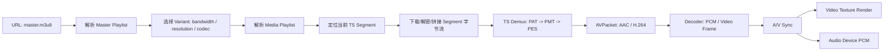

# HLS + TS 播放流程：从 m3u8 到解码、同步与渲染

本文配套教学视频使用，目标是让播放器、音视频、客户端性能优化同学对
HLS + MPEG-TS 的播放链路形成同一张图：请求如何从 master playlist
走到某个 `.ts` segment，TS demux 如何从 PAT/PMT 找到音视频 PID，PES
如何变成带 PTS/DTS 的 `AVPacket`，最后如何进入解码、音画同步、视频纹理
渲染和音频 PCM 播放。

源码依据以当前仓库为准：

- HLS demux：`libavformat/hls.c`
- MPEG-TS demux：`libavformat/mpegts.c`
- 解码 API 示例：`doc/examples/demux_decode.c`
- 播放、同步、SDL 渲染参考：`fftools/ffplay.c`

## 1. 总览

HLS + TS 播放不是“一次下载一个视频文件”，而是一条持续运行的流水线：



FFmpeg 里有一个重要实现细节：HLS demuxer 本身不直接解析 TS 包。它负责
playlist、segment、HTTP、解密、seek、live reload 等 HLS 层逻辑，然后给每个
playlist 创建一个子 demuxer。对子 demuxer 来说，HLS 提供的是一个连续读取的
`AVIOContext`，子 demuxer 再探测出 `mpegts` 并输出真正的音视频 packet。

也就是说，典型链路是：

```text
hls demuxer
  parse master/media playlist
  choose segment and open HTTP/file input
  expose segment bytes through custom AVIOContext
    -> mpegts demuxer
       parse PAT/PMT/PES
       output AVPacket
         -> decoder
            output AVFrame
              -> sync/render/play
```

## 2. m3u8 解析与 TS 定位

### 2.1 Master Playlist

Master playlist 的职责是列出可选媒体版本。常见标签包括：

| 标签 | 作用 | 播放器关注点 |
| --- | --- | --- |
| `#EXTM3U` | m3u8 文件头 | 缺失时应拒绝解析 |
| `#EXT-X-VERSION` | HLS 协议版本 | 决定是否可用某些标签 |
| `#EXT-X-STREAM-INF` | 一个 variant 的属性 | `BANDWIDTH`、`CODECS`、`RESOLUTION`、`FRAME-RATE`、`AUDIO`、`SUBTITLES` |
| `#EXT-X-MEDIA` | 外挂 audio/subtitle/rendition | 多音轨、多语言、字幕组 |
| `#EXT-X-I-FRAME-STREAM-INF` | I-frame only variant | 快速 seek/缩略图场景 |
| `#EXT-X-SESSION-KEY` | 会话级 key | 避免每个 media playlist 重复下载 key |

当前 FFmpeg HLS demuxer 中，`parse_playlist()` 会处理 `#EXT-X-STREAM-INF`
并创建 variant；后续 URI 行会和刚解析出的属性关联，形成 playlist。源码位置：
`libavformat/hls.c:787`、`libavformat/hls.c:863`、`libavformat/hls.c:991`。

Master playlist 示例：

```m3u8
#EXTM3U
#EXT-X-VERSION:3
#EXT-X-MEDIA:TYPE=AUDIO,GROUP-ID="aud",NAME="stereo",DEFAULT=YES,URI="audio.m3u8"
#EXT-X-STREAM-INF:BANDWIDTH=1800000,RESOLUTION=1280x720,CODECS="avc1.64001f,mp4a.40.2",AUDIO="aud"
v720/prog.m3u8
#EXT-X-STREAM-INF:BANDWIDTH=4200000,RESOLUTION=1920x1080,CODECS="avc1.640028,mp4a.40.2",AUDIO="aud"
v1080/prog.m3u8
```

播放器选择 variant 时通常综合：

- 估算带宽：已下载 segment 的吞吐、CDN RTT、失败率。
- 解码能力：H.264 profile/level、分辨率、帧率、硬解支持。
- 屏幕条件：视口大小、DPR、后台/小窗状态。
- 启播策略：先低码率快速起播，再升档。

FFmpeg 的 demuxer 主要负责暴露所有 variant/program，选择策略通常由播放器上层或
调用者通过 stream/program discard 来控制。

### 2.2 Media Playlist

Media playlist 负责列出可播放 segment，并给出时长、序号、加密、字节范围等信息。
当前 FFmpeg `parse_playlist()` 重点处理这些标签：

| 标签 | 作用 | FFmpeg 处理点 |
| --- | --- | --- |
| `#EXT-X-TARGETDURATION` | playlist 最大 segment 时长上界 | `target_duration`，live reload 退避依据 |
| `#EXT-X-MEDIA-SEQUENCE` | 第一个 segment 的序号 | `start_seq_no`，定位当前 segment |
| `#EXT-X-PLAYLIST-TYPE` | `VOD` 或 `EVENT` | 是否可求总时长、是否保留历史 |
| `#EXT-X-MAP` | fMP4 初始化段 | 对 TS 常规链路通常没有；对 fMP4 重要 |
| `#EXT-X-KEY` | 加密方式、key URI、IV | AES-128 / SAMPLE-AES |
| `#EXTINF` | 下一个 segment 的时长 | 写入 `segment.duration` |
| `#EXT-X-BYTERANGE` | segment 是文件子范围 | 写入 `segment.url_offset`、`segment.size` |
| `#EXT-X-START` | 推荐起播时间 | `start_time_offset` |
| `#EXT-X-ENDLIST` | VOD/结束的 live | 标记 `finished` |

核心源码点：

- 入口和文件头检查：`libavformat/hls.c:787`、`libavformat/hls.c:845`
- `#EXT-X-STREAM-INF`：`libavformat/hls.c:863`
- `#EXT-X-KEY`：`libavformat/hls.c:867`
- `#EXT-X-MAP`：`libavformat/hls.c:916`
- `#EXTINF`：`libavformat/hls.c:971`
- segment URI 入表：`libavformat/hls.c:999`
- `#EXT-X-BYTERANGE` 写入 offset/size：`libavformat/hls.c:1068`

Media playlist 示例：

```m3u8
#EXTM3U
#EXT-X-VERSION:3
#EXT-X-TARGETDURATION:6
#EXT-X-MEDIA-SEQUENCE:1200
#EXTINF:6.000,
seg-1200.ts
#EXTINF:6.000,
seg-1201.ts
#EXTINF:5.960,
seg-1202.ts
```

定位某个 TS 的基本算法：

1. 如果是 VOD，默认从 `start_seq_no` 开始；如果 seek，则根据目标时间累加
   `EXTINF` duration，找到覆盖目标 timestamp 的 segment。
2. 如果是 live，默认用 `live_start_index` 从尾部倒数若干 segment 开始，避免追得
   太靠近直播边缘。
3. 当前播放进度存在时，跨 playlist/variant 切换尽量沿用当前 `cur_seq_no` 或按
   timestamp 重新定位。
4. 得到 `cur_seq_no` 后，segment 数组下标是
   `cur_seq_no - start_seq_no`，即 FFmpeg 的 `current_segment()` 逻辑。

相关源码：

- 起播 segment 选择：`libavformat/hls.c:2244`
- `select_cur_seq_no()`：`libavformat/hls.c:1963`
- `current_segment()`：`libavformat/hls.c:1115`
- seek 按时间找 segment：`libavformat/hls.c:1918`

### 2.3 下载、解密与连续字节流

HLS segment 打开由 `open_input()` 负责：

- 对 `#EXT-X-BYTERANGE` 设置 HTTP `offset` / `end_offset`。
- 对 AES-128 先下载 key，再把 URL 包成 `crypto:` 或 `crypto+http:`。
- 对本地文件的 byte range 用 `avio_seek()` 补齐定位。

源码：`libavformat/hls.c:1391`。

真正给子 demuxer 喂数据的是 `read_data_continuous()`：

1. 必要时 reload live playlist。
2. 找到 `current_segment()`。
3. 如有 init section，先输出 init section。
4. 打开当前 segment。
5. 如果 HTTP 支持 multiple requests，会预打开下一个 segment。
6. 调用 `read_from_url()` 读取 bytes。
7. 当前 segment EOF 后关闭或标记 keepalive，`cur_seq_no++`，进入下一段。

源码：`libavformat/hls.c:1651`、`libavformat/hls.c:1719`、`libavformat/hls.c:1734`。

### 2.4 HLS demuxer 如何连接 TS demuxer

`hls_read_header()` 做了这几件事：

1. `parse_playlist()` 解析初始 m3u8。
2. 如果初始文件是 master playlist，再解析每个 media playlist。
3. 创建 FFmpeg program，关联 variant。
4. 为每个 playlist 创建 `AVFormatContext` 子 demuxer。
5. 用 `ffio_init_context()` 创建自定义 `AVIOContext`，read callback 指向
   `read_data_continuous()`。
6. 对这个字节流 `av_probe_input_buffer()`，常规 HLS + TS 会探测为 `mpegts`。
7. `avformat_open_input()` 打开子 demuxer。
8. 将子 demuxer 的 streams 映射到 HLS demuxer 对外暴露的 streams。

源码：`libavformat/hls.c:2144`、`libavformat/hls.c:2294`、`libavformat/hls.c:2348`、
`libavformat/hls.c:2389`、`libavformat/hls.c:2398`。

`hls_read_packet()` 再从所有需要的 playlist 里各缓存一个 packet，选择 DTS 最小的
packet 对外返回。这是多 playlist、多 rendition 场景下保持输出顺序的关键。

源码：`libavformat/hls.c:2546`、`libavformat/hls.c:2631`、`libavformat/hls.c:2687`。

## 3. TS Demux：PAT -> PMT -> PES -> AVPacket

### 3.1 TS 包结构

MPEG-TS 常规包长 188 字节，首字节固定是 sync byte `0x47`。关键字段：

| 字段 | 作用 |
| --- | --- |
| `transport_error_indicator` | 当前包是否有传输错误 |
| `payload_unit_start_indicator` | payload 是否是 PES/section 起始 |
| `PID` | 包属于哪个逻辑流 |
| `adaptation_field_control` | 是否有 adaptation field / payload |
| `continuity_counter` | 同一 PID 的连续性检查 |
| `PCR` | 在 adaptation field 中，给系统时钟参考 |

FFmpeg 的 `handle_packet()` 会解析 PID、PUSI、adaptation field、PCR、continuity
counter，并按 PID 找到 filter：section filter 处理 PAT/PMT，PES filter 处理音视频。

源码：`libavformat/mpegts.c:3036`。

### 3.2 PAT：找到 PMT PID

PAT 固定在 PID `0x0000`。它把 program number 映射到 PMT PID：

```text
PID 0x0000 -> PAT
  program 1 -> PMT PID 0x1000
```

FFmpeg 在 `mpegts_read_header()` 中打开 PAT section filter：

```text
mpegts_open_section_filter(ts, PAT_PID, pat_cb, ts, 1)
```

源码：`libavformat/mpegts.c:3383`、`libavformat/mpegts.c:3408`。

`pat_cb()` 解析 PAT 后：

1. 读取 `sid` 和 `pmt_pid`。
2. 创建 `AVProgram`。
3. 对 PMT PID 打开新的 section filter，回调是 `pmt_cb()`。
4. 记录 program -> pid 映射。

源码：`libavformat/mpegts.c:2801`、`libavformat/mpegts.c:2829`、`libavformat/mpegts.c:2862`。

### 3.3 PMT：找到音视频 PID 与 codec

PMT 告诉播放器当前 program 里有哪些 elementary stream：

```text
PMT PID 0x1000
  PCR PID: 0x0100
  stream_type 0x1b -> H.264 video PID 0x0100
  stream_type 0x0f -> AAC audio  PID 0x0101
```

HLS + TS 常见类型在 FFmpeg `ISO_types` 中映射：

- `STREAM_TYPE_AUDIO_AAC` -> `AV_CODEC_ID_AAC`
- `STREAM_TYPE_VIDEO_H264` -> `AV_CODEC_ID_H264`

源码：`libavformat/mpegts.c:815`、`libavformat/mpegts.c:820`、`libavformat/mpegts.c:827`。

`pmt_cb()` 的关键动作：

1. 解析 PMT section header。
2. 读取 `pcr_pid`。
3. 遍历 ES 条目，得到 `stream_type` 和 ES `pid`。
4. 如果是 PES stream，调用 `add_pes_stream()` 给该 PID 建 PES filter。
5. 创建或复用 `AVStream`。
6. 调用 `mpegts_set_stream_info()` 设置 codec、time_base、parser 需求。

源码：`libavformat/mpegts.c:2577`、`libavformat/mpegts.c:2631`、
`libavformat/mpegts.c:2680`、`libavformat/mpegts.c:2713`、
`libavformat/mpegts.c:2755`。

### 3.4 PES：拼出带 PTS/DTS 的 AVPacket

PES 是 elementary stream 的封装层。PES header 里常见信息：

- start code prefix：`0x000001`
- stream id
- PES packet length
- PTS/DTS flags
- PTS/DTS value，单位通常是 90 kHz

FFmpeg 的 `mpegts_push_data()` 是 PES 状态机：

```text
MPEGTS_HEADER
  读取 PES_START_SIZE，确认 0x000001
MPEGTS_PESHEADER
  读取固定 PES header
MPEGTS_PESHEADER_FILL
  读取扩展 header，解析 PTS/DTS
MPEGTS_PAYLOAD
  收集 ES payload
  到新 PES 起点或已知长度完整时输出 AVPacket
```

源码：`libavformat/mpegts.c:1179`、`libavformat/mpegts.c:1205`、
`libavformat/mpegts.c:1311`、`libavformat/mpegts.c:1418`。

`new_pes_packet()` 把收集到的 payload 变成 `AVPacket`：

- `pkt->data / pkt->size` 指向 PES payload。
- `pkt->stream_index` 指向 PMT 建出的 `AVStream`。
- `pkt->pts / pkt->dts` 来自 PES header。
- `pkt->pos` 记录第一个 TS 包位置。
- `pkt->flags` 带上 continuity/TEI 等错误标记。

源码：`libavformat/mpegts.c:1031`、`libavformat/mpegts.c:1071`。

`mpegts_read_packet()` 只是外部入口：设置 `ts->pkt`，调用 `handle_packets()`，
直到某个 PES filter 输出一个 packet。

源码：`libavformat/mpegts.c:3531`。

## 4. AAC ADTS 与 H.264 Annex-B

### 4.1 AAC in TS：ADTS AAC

HLS + TS 中常见 AAC 是 ADTS 形式。每个 AAC access unit 前有 ADTS header：

```text
syncword 0xFFF
profile
sampling_frequency_index
channel_configuration
frame_length
```

FFmpeg 的 MPEG-TS demuxer 根据 PMT `stream_type 0x0f` 设置 codec 为 AAC。
AAC parser 使用 ADTS header 找同步和帧长。源码参考：

- stream type 映射：`libavformat/mpegts.c:820`
- AAC parser：`libavcodec/aac_parser.c:33`
- ADTS header parse：`libavcodec/adts_header.c`

进入 decoder 后，AAC packet 解码为 PCM frame。实际播放前通常还要：

- 转成音频设备支持的 sample format，例如 S16/F32。
- 匹配输出 sample rate。
- 匹配 channel layout。
- 根据音画同步策略做轻微重采样补偿。

ffplay 的音频转换与补偿可参考 `fftools/ffplay.c:2422`、`fftools/ffplay.c:2457`、
`fftools/ffplay.c:2495`。

### 4.2 H.264 in TS：Annex-B H.264

TS 里的 H.264 通常是 Annex-B byte stream：

```text
00 00 00 01 09 ...       AUD, optional
00 00 00 01 67 ...       SPS
00 00 00 01 68 ...       PPS
00 00 00 01 65 ...       IDR slice
00 00 00 01 41 ...       non-IDR slice
```

和 MP4/AVCC 的长度前缀不同，Annex-B 依赖 start code 分隔 NAL unit。播放器要注意：

- SPS/PPS 变化会影响 decoder context、分辨率、像素格式。
- B 帧会导致 DTS 和 PTS 不同：DTS 是解码顺序，PTS 是显示顺序。
- IDR/关键帧是 seek 后解码恢复的主要锚点。

FFmpeg H.264 parser 会寻找 start code、判断帧边界、解析 SPS/PPS/SEI 等信息。
源码参考：`libavcodec/h264_parser.c:1`、`libavcodec/h264_parser.c:56`。

## 5. 解码、同步、渲染与播放

### 5.1 解码主循环

播放器常规 API 流程：

```c
avformat_open_input(&fmt, url, NULL, &opts);
avformat_find_stream_info(fmt, NULL);
av_find_best_stream(fmt, AVMEDIA_TYPE_VIDEO, ...);
av_find_best_stream(fmt, AVMEDIA_TYPE_AUDIO, ...);
avcodec_parameters_to_context(dec_ctx, stream->codecpar);
avcodec_open2(dec_ctx, decoder, NULL);

while (av_read_frame(fmt, pkt) >= 0) {
    route pkt by pkt->stream_index;
    avcodec_send_packet(dec_ctx, pkt);
    while (avcodec_receive_frame(dec_ctx, frame) == 0) {
        render_or_play(frame);
    }
}
```

FFmpeg 示例：`doc/examples/demux_decode.c`。

ffplay 更接近真实播放器结构：一个 read thread 调 `av_read_frame()`，按 stream 放入
audio/video packet queue；音频和视频各自 decoder thread 消费 queue 并产出 frame。
源码参考：`fftools/ffplay.c:3154`、`fftools/ffplay.c:3207`。

### 5.2 音画同步

同步的核心不是“两个流同时解码”，而是所有 frame 都转换到同一时间轴，然后决定：

- 音频什么时候写入设备。
- 视频帧什么时候显示。
- 延迟过大时丢帧、重复帧、调音频采样数，还是追随外部时钟。

常见做法是音频作为 master clock：

```text
audio clock = 已播放到设备的 PCM 时间
video diff  = video_pts - audio_clock
if video too early: wait
if video slightly late: shorten delay / immediately display
if video very late: drop frame
if audio drift small: swr compensation
```

ffplay 的 clock 和 sync 参考：

- `Clock` 读写：`fftools/ffplay.c:1428`
- 选择 master clock：`fftools/ffplay.c:1476`
- 视频 delay 修正：`fftools/ffplay.c:1579`
- 音频重采样补偿：`fftools/ffplay.c:2449`、`fftools/ffplay.c:2485`
- 音频设备回调里扣除硬件 buffer 延迟：`fftools/ffplay.c:2531`、`fftools/ffplay.c:2567`

TS/HLS 特别要注意：

- TS PES 里 PTS/DTS 是 90 kHz，需要按 `AVStream.time_base` 转成秒。
- PTS 有 33-bit wrap，需要做 wrap detect；HLS 也会遇到 discontinuity。
- Live playlist 可能滑窗，`MEDIA-SEQUENCE` 变动会影响“第一个 segment 对应的时间”。
- 多 rendition 可能首包时间不完全对齐，起播阶段要等待足够 stream info 或用策略补齐。

### 5.3 视频纹理渲染

解码后的视频通常是 YUV frame，例如 `AV_PIX_FMT_YUV420P`。性能上应优先：

- 直接上传 YUV planes 到 GPU texture。
- 在 shader 或平台原生 video layer 中做 YUV -> RGB。
- 避免 CPU 上每帧 `sws_scale()` 到 RGB，除非平台限制。
- 纹理复用，分辨率/像素格式变化时再重建。

ffplay 的 SDL 路径可以作为参考：如果是 IYUV，就调用 `SDL_UpdateYUVTexture()` 上传
Y、U、V 三个 plane；否则用 `SDL_UpdateTexture()`。源码：
`fftools/ffplay.c:908`。

生产播放器常见实现：

```text
AVFrame(YUV) -> GPU texture planes -> color conversion shader -> compositor
```

硬解路径下要尽量保持 zero-copy：

```text
HW decoder surface -> platform texture -> renderer
```

### 5.4 音频 PCM 播放

AAC decoder 输出 `AVFrame`，里面包含 sample format、sample rate、channel layout。
音频设备通常要求固定输出格式，所以要使用 resampler：

```text
AAC AVPacket -> AAC Decoder -> AVFrame(samples)
  -> swr_convert / platform resampler
  -> ring buffer
  -> audio device callback
```

ffplay 中 `audio_decode_frame()` 负责从 frame queue 取 decoded audio frame，必要时
创建 `SwrContext`，转换为目标设备格式；`sdl_audio_callback()` 再把 buffer 写给
SDL 音频设备。源码：`fftools/ffplay.c:2422`、`fftools/ffplay.c:2531`。

## 6. 性能优化检查表

### 6.1 启播延迟

优化目标：首帧时间、首声音时间、A/V 首次同步时间。

建议：

- Master 和 media playlist 请求尽量复用 DNS/TLS/HTTP 连接。
- 首个 variant 不要盲目选最高码率；按设备和估算带宽选可快速起播的档位。
- 降低不必要的 probe/analyze 时间，但要保留足够信息识别 AAC/H.264、SPS/PPS、duration。
- HLS + TS 首个 segment 内通常要先读到 PAT/PMT，再读到音视频 PES；不要把首包等待误判为网络慢。
- 如果有独立 audio playlist，起播要并发拉 audio/video segment。

FFmpeg 相关实现点：

- HLS 子 demuxer probe 默认较小：`libavformat/hls.c:2348`
- TS header 阶段扫描 PAT/PMT：`libavformat/mpegts.c:3408`

### 6.2 网络与 playlist reload

指标：

- playlist reload 间隔和耗时
- segment download time / segment duration
- HTTP 复用命中率
- 重试次数和跳段次数
- live edge distance

建议：

- 使用 HTTP keep-alive / HTTP/2 multiplexing。
- 对 `#EXT-X-BYTERANGE` 使用 Range 请求，避免整文件下载。
- 对 live 按 target duration 控制 reload，避免过度轮询。
- 区分 CDN 404、超时、慢速、内容损坏；错误策略不要全部映射成“降码率”。
- 预连接或预请求下一个 segment，但要注意 ABR 切换和浪费流量。

FFmpeg 相关实现点：

- `http_persistent` / `http_multiple`：`libavformat/hls.c:1397`、`libavformat/hls.c:1719`
- live reload：`libavformat/hls.c:1574`
- segment retry/skip：`libavformat/hls.c:1689`

### 6.3 TS demux

指标：

- PAT/PMT 首次发现耗时
- continuity counter 错误次数
- TEI 错误次数
- PES packet size mismatch
- PTS/DTS 缺失比例
- parser request_probe 次数

建议：

- 对固定 HLS + TS 内容，尽量缓存稳定的 PMT 信息，但必须正确处理 discontinuity 和 PMT 版本变化。
- 遇到 continuity error 要标记 corrupt，并观察是否导致 decoder 花屏/静音。
- 丢包或乱序时，优先让关键帧恢复视频；音频可通过小缓冲和静音补偿降低感知。
- 不要把 PID 过滤做成全量扫描热点；按 PAT/PMT 建 filter。

FFmpeg 相关实现点：

- continuity counter：`libavformat/mpegts.c:3067`
- TEI corrupt：`libavformat/mpegts.c:3086`
- PAT/PMT filter：`libavformat/mpegts.c:2801`、`libavformat/mpegts.c:2577`
- PES 输出：`libavformat/mpegts.c:1031`

### 6.4 解码

指标：

- packet queue 深度
- decoder queue 深度
- decode time per frame
- hardware decoder fallback 次数
- SPS/PPS 变化次数
- late frame/drop frame 数

建议：

- H.264 优先硬解，尤其是移动端和 1080p+。
- 对 Annex-B 确保 SPS/PPS 在 decoder 需要时可见；seek 后从关键帧恢复。
- B 帧会引入重排延迟，低延迟场景要控制编码参数。
- decoder 输出分辨率变化时，渲染链路要异步重建 texture，避免阻塞播放线程。

### 6.5 渲染与音频输出

视频：

- 优先 YUV texture 直传；避免每帧 CPU 色彩转换。
- texture pool 按分辨率和 pixel format 分组。
- 渲染线程不要等待网络/demux/decoder 锁。
- 监控 render deadline miss 和 compositor latency。

音频：

- 音频 callback 中只做拷贝/混音，避免复杂锁和内存分配。
- resampler 复用，只有格式变化时重建。
- 小 drift 用重采样补偿，大 drift 才考虑丢/插音频或 seek。
- 记录 audio device buffer latency，A/V sync 计算必须扣掉还没真正播放的 PCM。

## 7. 团队排障流程

建议排查顺序：

1. Playlist：master 是否选对 variant？media playlist 是否有目标 segment？live 是否追得太靠前？
2. Network：segment 下载时间是否超过 segment duration？是否频繁重试/跳段？
3. TS：是否拿到 PAT/PMT？音视频 PID 是否稳定？continuity/TEI 是否异常？
4. Packet：AAC/H.264 packet 是否有合理 PTS/DTS？是否出现长时间无视频或无音频 packet？
5. Decode：decoder 是否输出 frame？是否因为 SPS/PPS、profile、硬解失败卡住？
6. Sync：video 是否太晚被丢？audio clock 是否扣除了硬件 buffer？
7. Render/Audio：texture 上传、音频 callback 是否阻塞？设备格式转换是否频繁重建？

最小监控字段：

```text
playlist_url, variant_bitrate, media_sequence, segment_seq, segment_url
segment_duration_ms, download_ms, download_bytes, retry_count
pat_seen, pmt_seen, audio_pid, video_pid, pcr_pid
packet_stream, packet_pts_ms, packet_dts_ms, packet_size
audio_queue_ms, video_queue_ms, av_diff_ms
decode_video_ms, decode_audio_ms, render_ms
dropped_frames, late_frames, audio_underrun_count
```

## 8. 教学视频脚本结构

视频建议分 8 段：

| 时间段 | 主题 | 画面重点 |
| --- | --- | --- |
| 0:00-0:12 | 总览 | URL 到音视频输出的整条链路 |
| 0:12-0:28 | Master Playlist | variant 选择、带宽、codec、resolution |
| 0:28-0:48 | Media Playlist | `MEDIA-SEQUENCE`、`EXTINF`、定位 segment |
| 0:48-1:05 | HLS Demux 内部 | custom AVIO、segment 连续字节流、子 demuxer |
| 1:05-1:28 | TS 包与 PAT | 188 bytes、PID、PAT 找 PMT |
| 1:28-1:55 | PMT 与 PES | audio/video PID、stream type、PTS/DTS |
| 1:55-2:20 | AAC/H.264 Decode | ADTS、Annex-B、decoder 输出 PCM/frame |
| 2:20-2:45 | Sync 与性能优化 | audio master、video delay、关键指标 |

## 9. 一句话模型

HLS 解决“什么时候下载哪个小文件”，TS 解决“这个小文件里的字节属于哪些音视频流”，
PES/PTS/DTS 解决“每个压缩帧什么时候解码和显示”，播放器同步与渲染解决“怎样按正确时间
把 PCM 送进音频设备、把视频帧送进 GPU”。
