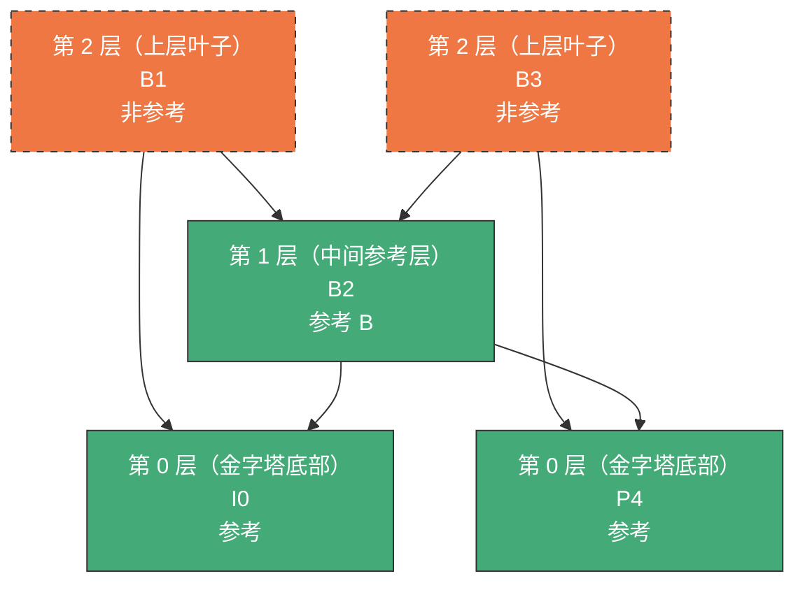
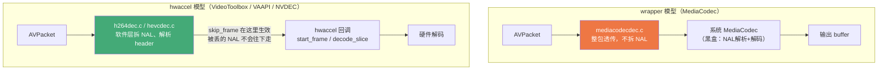
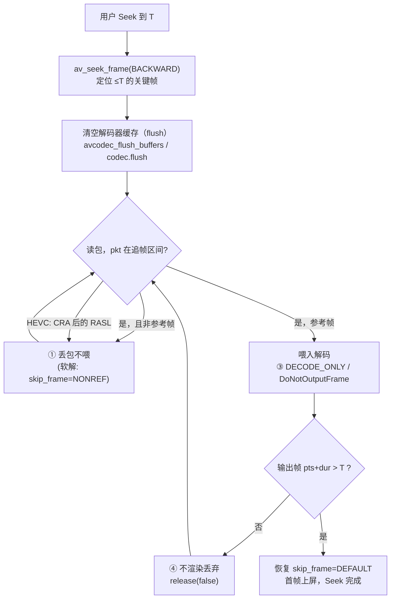

# 点播 Seek 性能优化：丢帧的原理、判定与硬解落地

> 🎮 本文配有一个交互可视化版本：线上直接访问
> **<https://seek-nonref-frame-dropping.vercel.app>**（或本地打开
> [seek-nonref-frame-dropping.html](seek-nonref-frame-dropping.html)）
> ——参考链 3D 依赖图、NAL 头字节检查器、四作用点流水线等可动手操作的演示
> （3D 场景经 CDN 加载 Three.js，需联网）。

用户拖动进度条之后，画面多久能出来，是点播播放器最直观的体验指标之一。
Seek 慢的根源几乎总是同一个：**目标时间点不是关键帧（不依赖任何其他帧、
自身就能独立解码的帧——视频只能从这种帧开始解），播放器必须退回到前面
最近的关键帧，把中间所有帧都解码一遍，才能"追"到目标位置**。这段追帧
过程（行话叫 preroll）的耗时与需要解码的帧数成正比。而其中相当一部分帧
其实可以不解码——它们不被任何其他帧引用，丢掉不会产生任何画质代价。

本文围绕"丢帧"这一个杠杆，把问题讲透：

1. 哪些帧可以安全地丢？——参考帧与 I/B/P 的真实关系；
2. 怎么在不解码的前提下判定一帧是否可丢？——只看 H.264/H.265 码流
   "包裹标签"（NAL 头，第 3 章有背景介绍）的 1~2 个字节；
3. 在哪里丢？——从 FFmpeg 软解（用 CPU 跑解码）到 Android 的
   MediaCodec、iOS 的 VideoToolbox（两大移动平台的系统硬解接口，
   解码交给芯片里的专用硬件），丢帧可以发生在流水线的四个不同位置，
   成本收益各不相同。

文中 FFmpeg 源码定位均基于当前仓库代码（`路径:行号`）。


---

## 1. Seek 为什么慢：追帧的成本模型

视频只能从关键帧开始解码——H.264 里这种帧叫 IDR，H.265 里叫 IRAP，
名字不同，意思一致：自身携带完整画面信息、不需要任何前置帧。相邻两个
关键帧之间的一段帧序列称为一个 GOP（Group of Pictures，画面组）。
Seek 到任意时间点 T 时，播放器的标准动作是：

```text
             ┌───────────────── 追帧区间（全部要解码，但都不上屏）──────────────┐
             │                                                              │
 ... ──────[I0]──B──B──P──B──B──P──B──B──P──B──B──P──B──B──[P?]────────[I60]── ...
             ▲                                              ▲
             │                                              │
      av_seek_frame(BACKWARD)                          目标时间 T
      定位到 ≤T 的关键帧                            （第一帧 pts ≥ T 才上屏）
```

图中 pts 指显示时间戳（presentation timestamp，决定一帧该在什么时刻
显示）；"上屏"即真正渲染到屏幕。追帧区间里解出来的帧都不上屏，纯粹是
给后面的帧当解码底子。于是 Seek 耗时可以粗略拆成：

```text
seek_latency ≈ 定位/IO 耗时 + N_preroll × t_decode + t_first_render

N_preroll：关键帧到目标帧之间需要解码的帧数（最坏 = GOP 长度）
t_decode ：单帧解码耗时
```

点播场景 GOP 普遍在 2~10 秒（48~600 帧），`N_preroll × t_decode` 是绝对
大头。优化只有两个方向：

- **少解码**：把追帧区间里"没人依赖"的帧直接丢掉——本文主题；
- **快解码**：让解码器远快于播放速度地跑，即"超实时解码"（Android 的
  `KEY_OPERATING_RATE`、iOS 的异步解码等），第 5 节顺带覆盖。

丢帧的前提是搞清楚：**丢掉一帧，会不会破坏后面帧的解码？** 这就引出参考
帧的概念。

---

## 2. 哪些帧可以丢：参考性才是唯一判据

### 2.1 参考链与 DPB

视频压缩的核心手段是"帧间预测"：一帧不必存完整画面，只记录它与某些
已解码帧之间的差异，解码时再拿那些帧当底子还原出来。被当作底子的帧就是
**参考帧**；"谁参考谁"连起来形成的依赖链，就是**参考链**。

为此，H.264/H.265 解码器内部维护一小块缓存，叫 **DPB（Decoded Picture
Buffer，解码图像缓存）**：解码完的帧如果还会被后续帧当参考，就留在 DPB
里备用；不会被引用的帧输出后立即释放。据此所有帧分成两类：

- **参考帧（reference）**：进 DPB，后续帧依赖它。丢掉它 → 依赖它的帧
  解码出错 → 错误沿参考链逐帧扩散 → 花屏；
- **非参考帧（non-reference）**：不进 DPB，没有任何帧依赖它。丢掉它，
  解码器甚至不知道它存在过，**唯一的代价是这一帧的画面本身不出现**——
  而追帧区间的画面本来就不上屏，等于零代价。

### 2.2 参考性和 I/B/P 是两个正交维度

很多资料把"丢非参考帧"等同于"丢 B 帧"，这是错的。I/B/P 和参考性是
两个互相独立的属性，可以从依赖关系的两个相反方向来理解：

- **I/B/P 帧类型描述"当前帧怎样参考别人"**：I 帧不参考任何帧，独立
  解码；P 帧从一份候选参考帧清单（参考列表）里选帧做预测，通常参考它
  前面的帧；B 帧可以用两份参考列表，通常同时利用显示时间在它前、后的
  参考帧。这个类型记录在 slice header 里的 `slice_type` 字段（slice 是
  一帧内部的分条，一帧由一个或多个 slice 组成；slice header 是每条开头
  的说明信息）。
- **参考性描述"当前帧是否会被别人参考"**：参考帧解码后要留在 DPB 中
  给后来的帧当底子；非参考帧输出后立即释放。H.264/H.265 把这个信息写在
  NAL 头中（第 3 章展开）。

换句话说，I/B/P 回答"**它需要谁**"，参考性回答"**以后谁需要它**"。
一个说的是当前帧的输入，一个说的是当前帧会不会成为别人的输入，二者
互相推导不出来。组合出的六种情况在真实码流里都可能存在：

| | 参考帧 | 非参考帧 |
| --- | --- | --- |
| **I** | IDR（标准规定必为参考）、普通 I | 理论存在，实践罕见 |
| **P** | 绝大多数 P | 少见（低延迟/时域分层编码会出现，见 3.2 ①） |
| **B** | **B-pyramid 的中层 B（主流编码器 x264/x265 默认开启）** | 最常见的可丢帧 |

#### B-pyramid：为什么 B 帧也能成为参考帧

传统的 B 帧只参考前后的 I/P 参考帧，自己不再被别的帧使用。以显示顺序
`I0 B1 B2 B3 P4` 为例，B1、B2、B3 都可以只作为"叶子"，解码并显示后
立即释放。

**B-pyramid（B 帧金字塔）**会把连续 B 帧组织成层级：先选择中间的 B2，
让它参考 I0 和 P4；再把解码后的 B2 保留在 DPB 中，让两侧的 B1、B3
继续参考它。于是 B2 虽然仍然是 B 帧——它仍使用两个参考列表预测自己——
却同时成为了其他 B 帧的参考帧。连续 B 帧更多时还可以继续分层，形成
"锚点 → 参考 B → 非参考 B"的层级引用结构，因此得名。这里的
"pyramid"强调的是**层级依赖**，不表示图形一定只有一个几何尖顶。

下面是一个典型的 mini-GOP（编码参数 `bf=3`，即最多连续 3 个 B 帧，且
开启 b-pyramid）。先只看显示时间轴：


再把同样五帧按引用关系分层，就能看到 b-pyramid。为了避免"顶/底"歧义，
本文把 I0、P4 所在的基础锚点称为**第 0 层（金字塔底部）**，把 B2 称为
**第 1 层（中间参考层）**，把 B1、B3 称为**第 2 层（上层叶子）**。
这里的层号只是解释依赖关系的简化编号，不等同于 HEVC 码流里的
`TemporalId`。箭头 `A --> B` 表示"A 解码时参考 B"，也就是 A 依赖 B：



- 显示顺序是 `I0 B1 B2 B3 P4`；
- 从图形位置看，I0、P4 构成金字塔底部，B2 位于中间，B1、B3 是最上层
  的叶子节点；层号越高，对低层帧的依赖越多；
- 解码器要先得到作为锚点的 I0、P4，再解码 B2，最后才能解码依赖 B2 的
  B1、B3，所以解码顺序是 `I0 P4 B2 B1 B3`；
- **B2 是"参考 B"**：B1 和 B3 都引用它，提前丢掉会破坏参考链；
- B1、B3 没有被其他帧引用，是最高依赖层的叶子 B，可以安全丢弃。

B-pyramid 让叶子 B 使用距离更近的参考帧，通常能提高压缩效率；代价是
部分 B 帧变成了参考帧，不能再作为无依赖帧随意丢弃。

两个直接推论：

1. **按 `pict_type == B` 丢帧是不安全的**——会误伤 B2 这类参考 B；
2. **按"参考性"丢帧是绝对安全的**——非参考帧不进 DPB，参考链完整无损。

> 顺带说明收益上限：在上述 b-pyramid 结构中，连续 3 个 B 里只有 2 个
> 非参考；典型点播流的非参考帧占比在 1/3 ~ 1/2 之间。常见编码配置关闭
> b-pyramid 后，B 帧不再相互参考，可丢的非参考 B 通常更多。

---

## 3. 如何判定：NAL 头 1~2 字节就够了

先补一个背景。H.264/H.265 的码流由一个个 **NAL 单元**（Network
Abstraction Layer unit）组成：编码器把所有输出切成这种统一格式的
"数据包裹"，每个包裹开头有 1~2 字节的 **NAL 头**，标明包裹里装的是
什么。真正装着图像数据的叫 **VCL NAL**（Video Coding Layer，视频编码
层）；其余是非 VCL NAL，比如记录分辨率等全局参数的 SPS/PPS（参数集）、
携带附加信息的 SEI。

好消息是：判定一帧是否可丢，**不需要解码，甚至不需要解析 slice
header**——两个标准都把参考性直接写在了 NAL 头里。这正是"解码前丢帧"
可行的根本原因。

### 3.1 H.264：看 `nal_ref_idc`

H.264 的 NAL 头只有 1 字节：

```text
 ┌─────────────┬──────────────┬─────────────────┐
 │ forbidden(1)│ nal_ref_idc(2)│ nal_unit_type(5)│
 └─────────────┴──────────────┴─────────────────┘
   bit7          bit6..5         bit4..0
```

```c
int ref_idc  = (nal[0] >> 5) & 0x3;   /* == 0 → 非参考帧 */
int nal_type =  nal[0] & 0x1F;        /* 5 == IDR slice, 1 == 非 IDR slice */
```

- `nal_ref_idc == 0`：本帧不作参考，可安全丢弃；
- 标准（H.264 7.4.1，`nal_ref_idc` 语义）约束同一帧所有 slice 的
  `nal_ref_idc` 必须一致，
  且 IDR/SPS/PPS 所在 NAL 必须非 0——所以**读 AU 里第一个 VCL NAL
  就能判定整帧**。

I/B/P 则要再多解析一层 slice header：`slice_type` 是其中第二个字段
（排在 `first_mb_in_slice` 之后），用指数哥伦布编码（Exp-Golomb，一种
按位存储的变长编码）写入，需要逐位读取：

| slice_type | %5 | 帧类型 |
| ---: | ---: | --- |
| 0 / 5 | 0 | P |
| 1 / 6 | 1 | B |
| 2 / 7 | 2 | I |
| 3 / 8 | 3 | SP |
| 4 / 9 | 4 | SI |

值 ≥5 表示"整帧所有 slice 同类型"。FFmpeg 的映射表在
`libavcodec/h264data.c:37`（`ff_h264_golomb_to_pict_type[slice_type % 5]`），
parser 的完整用法在 `libavcodec/h264_parser.c:364`。

关键帧判定除了 `nal_unit_type == 5`（IDR），还要认 **recovery point
SEI**：有些流的关键帧不是 IDR，而是用这种 SEI 消息标出"从这里进入、
播放若干帧后画面可完全恢复"的位置（多见于 open-GOP 流，open-GOP 的
含义见 3.2 ②；FFmpeg 的处理在 `libavcodec/h264_parser.c:366`）。

### 3.2 H.265：看 `nal_unit_type` 的奇偶

HEVC 取消了 `nal_ref_idc`，把参考性直接编码进 NAL 类型。NAL 头 2 字节：

```text
 ┌─────────────┬──────────────────┬────────────────┬───────────────────────┐
 │ forbidden(1)│ nal_unit_type(6) │ nuh_layer_id(6)│ nuh_temporal_id_plus1(3)│
 └─────────────┴──────────────────┴────────────────┴───────────────────────┘
```

```c
int nal_type = (nal[0] >> 1) & 0x3F;
int tid      = (nal[1] & 0x7) - 1;    /* TemporalId */
```

VCL 类型 0~15 成对出现，**偶数（`_N` 后缀）= 非参考，奇数（`_R` 后缀）=
参考**：

| 可丢（`_N`） | 值 | 参考版（`_R`） | 值 |
| --- | ---: | --- | ---: |
| TRAIL_N | 0 | TRAIL_R | 1 |
| TSA_N | 2 | TSA_R | 3 |
| STSA_N | 4 | STSA_R | 5 |
| RADL_N | 6 | RADL_R | 7 |
| RASL_N | 8 | RASL_R | 9 |
| VCL_N10/12/14（保留） | 10/12/14 | VCL_R11/13/15（保留） | 11/13/15 |

FFmpeg 的判定函数就是这张表：`ff_hevc_nal_is_nonref()`，
`libavcodec/hevc/hevcdec.h:653`。

两个 HEVC 特有的细节必须写清楚：

**① `_N` 的严格含义是"同一时域子层内非参考"（sub-layer non-reference）。**
先解释"时域分层"（temporal layering）：把帧分成若干"帧率层"，只解
第 0 层就得到一个低帧率版本，每多解一层帧率翻倍；NAL 头里的
`TemporalId` 就是层号。绝大多数点播流不用这个特性，只有一个时域层
（所有 NAL 的 `nuh_temporal_id_plus1 == 1`），此时 `_N` 就是真非参考，
直接丢——FFmpeg 软解也是这么做的，不看 TemporalId。如果流真的启用了
时域分层，严格安全的做法是只丢**最高 TemporalId 层**的 `_N` 帧；另外
"丢掉整个最高时域层"本身就是标准定义的合法降帧率手段（TSA/STSA 类型
就是为此设计的切换点）。

**② IRAP（16~23）里藏着 open-GOP 陷阱。**
IRAP（Intra Random Access Point，帧内随机访问点）是 H.265 对各种
"可以从这里开始解码"的关键帧的统称，NAL 类型值 16~23：

| 类型 | 值 | 含义 |
| --- | ---: | --- |
| BLA_W_LP / BLA_W_RADL / BLA_N_LP | 16/17/18 | 拼接产生的断点关键帧 |
| IDR_W_RADL / IDR_N_LP | 19/20 | 闭 GOP 关键帧（其后的帧绝不引用它之前的内容） |
| **CRA_NUT** | 21 | **open-GOP 关键帧**（允许跨界引用，压缩率更高） |

所谓 open-GOP（开放式 GOP），指 GOP 之间存在跨界引用：CRA 后面紧跟着
一批"前导帧"（leading picture）——显示时间在 CRA **之前**、解码顺序在
CRA **之后**的帧。用一段具体序列看会发生什么（数字为显示顺序）：

```text
显示顺序: … P28  P29 │ B30  B31  CRA32 │ B33 …
                       ▲ B30/B31 显示在 CRA32 之前、解码在它之后，
                         且参考了上一段的 P29

解码顺序: … P28  P29 │ CRA32  B30  B31 │ B33 …
```

编码器让 B30/B31 同时参考 CRA32 和上一个 GOP 的 P29——跨界"借"参考帧
能多省一点码率，这批帧就是 **RASL**（Random Access Skipped Leading，
类型 8/9）。同一段码流，两种播放路径的结局完全不同：

- **连续播放到这里**：P29 刚解完、还在 DPB 里，B30/B31 正常解码，
  一切正常；
- **Seek 直接跳到 CRA32**：P29 根本没被解码，B30/B31 需要的参考不存在，
  解不出来——**必须丢弃**，画面从 CRA32 开始显示。

另一类前导帧 **RADL**（Random Access Decodable Leading，类型 6/7）只参考
CRA32 本身、不依赖更早的内容，Seek 后仍可正常解码。这是 Seek 场景里
另一类"必丢帧"，与性能优化无关，属于正确性要求。

I/B/P 判定：HEVC slice header 的 `slice_type` 取值与 H.264 **不同**——
`0 = B, 1 = P, 2 = I`（映射见 `libavcodec/hevc/parser.c:143`）。

### 3.3 判定代码：一个包（AU）能不能整包丢

demuxer（解封装器，把 MP4/FLV 这类容器文件拆成一个个音视频压缩数据包）
吐出的一个 `AVPacket` 就是一个 **AU**（Access Unit，访问单元——一帧
画面对应的全部 NAL 的集合）。包内 NAL 的分隔方式取决于封装格式：
MP4/FLV 在每个 NAL 前放 4 字节长度前缀（AVCC/HVCC 格式）；TS 流则用
固定字节序列 start code（`00 00 01`）作边界（Annex B 格式）。以更常见
的长度前缀格式为例，完整的可丢判定不到 30 行：

```c
/* 返回 1：该 packet 的 VCL 全部非参考，可整包丢弃 */
static int packet_droppable(const uint8_t *data, int size,
                            int is_hevc, int nal_len_size /* 一般为 4 */)
{
    int i = 0;
    while (i + nal_len_size < size) {
        int nal_size = 0;
        for (int j = 0; j < nal_len_size; j++)
            nal_size = (nal_size << 8) | data[i + j];
        const uint8_t *nal = data + i + nal_len_size;
        if (nal_size <= 0 || i + nal_len_size + nal_size > size)
            break;                                  /* 数据异常，保守不丢 */

        if (is_hevc) {
            int type = (nal[0] >> 1) & 0x3F;
            if (type <= 15)                         /* VCL */
                return (type & 1) == 0;             /* _N 偶数 → 可丢 */
        } else {
            int type = nal[0] & 0x1F;
            if (type == 1 || type == 5)             /* VCL */
                return ((nal[0] >> 5) & 0x3) == 0;  /* ref_idc==0 → 可丢 */
        }
        i += nal_len_size + nal_size;               /* SPS/PPS/SEI：跳过继续找 */
    }
    return 0;
}
```

由 3.1/3.2 的"同帧一致性"约束，扫到包里第一个 VCL NAL 就能下结论——
前面最多跳过几个 SPS/PPS/SEI 这样的小单元。整个判定只读几个字节、不
复制任何数据，耗时可以忽略不计。

### 3.4 不想碰码流：三个现成的判定层

不想自己写 3.3 那样的 NAL 解析？FFmpeg 在三个不同阶段已经把"这一帧是
什么"的答案算好了，按付出的成本从低到高：

- **容器层——读包上的现成标记，零成本**。MP4 有个可选的 `sdtp` box
  （sample dependency table：封装时逐帧记录"是否被别的帧依赖"的元数据
  表）。demuxer 解析到 `sample_is_depended_on == 2`（明确没人依赖），就
  直接在数据包上打 `AV_PKT_FLAG_DISPOSABLE` 标记
  （`libavformat/mov.c:11692`；用 x265 编码时输出也自带，
  `libavcodec/libx265.c:932`）。判定只是查一个 bit：
  `pkt->flags & AV_PKT_FLAG_DISPOSABLE`。
  **缺点：封装工具没写 `sdtp` 就拿不到，此时退回 3.3 的 NAL 头解析。**
- **解析层——轻量解析，不解码**。`av_parser_parse2()` 是 FFmpeg 的
  码流解析器：只读各级头部信息、完全不解码像素，就能填出帧类型
  `pict_type`（I/B/P）和是否关键帧 `key_frame`，成本很低。
- **解码层——解完才知道，只能事后用**。解码输出的 `AVFrame` 上带
  `pict_type` 和 `AV_FRAME_FLAG_KEY`。此时解码成本已经花掉，只能服务
  "解码后丢帧"的场景（比如作用点④的不渲染判定）。

---

## 4. 在哪里丢：流水线上的四个作用点

判定解决了"丢谁"，接下来是"在哪丢"。同一帧可以在流水线的四个位置被
丢掉，越早丢省得越多：


| 作用点 | 省掉的成本 | 适用帧 | 依赖 |
| --- | --- | --- | --- |
| ① 喂入前丢包 | 解码 + 输出 + 渲染，全省 | 仅非参考帧 | 无（任何解码器都可用） |
| ② 解码器内跳过 | 同上（省掉 slice 解码） | 仅非参考帧（NONREF 级） | 解码器支持 `skip_frame` |
| ③ 解码不输出 | 输出拷贝/回调 + 渲染 | **任何帧**（参考链由解码器维持） | 平台 API 支持 |
| ④ 输出不渲染 | 仅渲染（纹理上传/GL） | 任何帧 | 无 |

①② 只能丢非参考帧，但收益最大；③④ 能丢任何帧（包括参考帧——因为解码
照常做，只是不出去），是精确 Seek 追帧的兜底手段。下面逐个展开。

### 4.1 作用点②：FFmpeg 软解的 `skip_frame`（原生支持）

FFmpeg 解码器通过 `AVCodecContext.skip_frame` 内建了这套逻辑，命令行对应
`-skip_frame noref`（选项表 `libavcodec/options_table.h:260`）：

```c
AVCodecContext *avctx = ...;
avctx->skip_frame = AVDISCARD_NONREF;   /* 追帧开始 */
/* ... 追上目标后 ... */
avctx->skip_frame = AVDISCARD_DEFAULT;  /* 恢复 */
```

两个解码器的实现位置值得在文章里点名，因为它揭示了"丢在多早"：

**H.264**（`libavcodec/h264dec.c:626`）——在 NAL 遍历循环的最前面：

```c
if (avctx->skip_frame >= AVDISCARD_NONREF &&
    nal->ref_idc == 0 && nal->type != H264_NAL_SEI)
    continue;
```

非参考 NAL 直接 `continue`，**连 slice header 都不解析**。帧级还有一处
阶梯式判断兜底（`libavcodec/h264_slice.c:2141`）。

**HEVC**（`libavcodec/hevc/hevcdec.c:3766`）：

```c
if (s->avctx->skip_frame >= AVDISCARD_ALL ||
    (s->avctx->skip_frame >= AVDISCARD_NONREF && ff_hevc_nal_is_nonref(nal->type)))
    continue;
```

`skip_frame` 是一个阶梯（`libavcodec/defs.h:223`）：

| 值 | 丢弃范围 | 参考链 | 适用场景 |
| --- | --- | --- | --- |
| `AVDISCARD_NONREF` (8) | 非参考帧 | **完好** | Seek 追帧、CPU 降级，无副作用 |
| `AVDISCARD_BIDIR` (16) | 所有 B 帧 | **被破坏**（误伤参考 B） | 不推荐 |
| `AVDISCARD_NONINTRA` (24) | 非 I 帧 | 被破坏 | 仅 all-intra 流 |
| `AVDISCARD_NONKEY` (32) | 非关键帧 | 被破坏 | 关键帧快进、缩略图 |
| `AVDISCARD_ALL` (48) | 全部 | — | 流禁用 |

**只有 `NONREF` 是"无损"档位**：输出的每一帧都和不丢帧时完全一致，只是
帧率变低。`BIDIR` 及以上都会断参考链，只能配合"丢到下一个关键帧为止"的
粗放策略使用。

配套的软解加速项（追帧期间画面不上屏，画质无所谓）：

- `avctx->skip_loop_filter = AVDISCARD_ALL`：跳过去块滤波（loop
  filter，解码末尾用来消除块状压缩痕迹的滤波步骤，
  `libavcodec/h264_slice.c:1962`），H.264 软解可省 10%~20%。注意：参考
  帧跳了滤波，画面会与编码器所用的参考产生细微偏差，且误差沿参考链
  逐帧累积（俗称"漂移"）；保守做法是只设到 `AVDISCARD_NONREF`（只跳
  非参考帧的滤波，零风险）；
- `avctx->flags2 |= AV_CODEC_FLAG2_FAST`：允许不完全合规的加速路径。

### 4.2 作用点①：喂入前丢包（硬解通用方案）

硬解码器（MediaCodec、VideoToolbox——对使用者是黑盒：只能喂数据、取
结果，无法干预内部行为）没有 `skip_frame` 这样的旋钮，但这不重要——
**非参考帧的定义本身就保证了解码器不需要它**。在 demux（解封装）之后、
喂入解码器之前把整包丢掉，解码器完全无感：

```text
AVPacket ──> [ 3.3 的 packet_droppable()? ──丢──> 释放 ]
                        │
                       喂入
                        ▼
              MediaCodec / VideoToolbox
```

三种实现，按工程成本排序：

1. **容器 flag**：`pkt->flags & AV_PKT_FLAG_DISPOSABLE`，有 `sdtp` 时零成本；
2. **自解析 NAL 头**：3.3 的函数，~30 行，无依赖，推荐兜底方案；
3. **FFmpeg 现成 BSF**（bitstream filter，码流过滤器：不解码，直接对
   压缩码流做删改）：`filter_units` 的 `discard` 选项
   （`libavcodec/bsf/filter_units.c:251`），判定逻辑与解码器一致——H.264 按
   `nal_ref_idc`（`libavcodec/cbs_h264.c:647`），H.265 按 `_N` 类型表
   （`libavcodec/cbs_h265.c:660`）。包内 VCL 全被删掉时，BSF 返回
   EAGAIN（"暂无输出"），整包自动被吞掉。可以先用命令行验证收益：

   ```bash
   # 数一数丢掉非参考帧后还剩多少帧（对比原始帧数）
   ffmpeg -i in.mp4 -c:v copy -bsf:v filter_units=discard=nonref -f null -
   ```

### 4.3 作用点③：解码但不输出（追参考帧时的兜底）

追帧区间里的**参考帧**没法不解码，但可以不让它走完"输出"这段路——
输出路径（像素拷贝、跨进程 buffer 流转、回调）在硬解上并不便宜：

- **Android 14+（API 34）**：`queueInputBuffer` 时带
  `MediaCodec.BUFFER_FLAG_DECODE_ONLY`——专为 Seek preroll 设计：解码、
  更新参考状态，但不产生输出 buffer；
- **iOS**：`VTDecompressionSessionDecodeFrame` 传
  `kVTDecodeFrame_DoNotOutputFrame`——同样是"解码入 DPB 但不回调输出"。

### 4.4 作用点④：输出但不渲染（最后的兜底）

解码输出已经拿到，只是不上屏。省掉的是把解码结果送上 GPU 并画出来的
开销（纹理上传 + OpenGL 绘制；Android 上即
`SurfaceTexture.updateTexImage` + OES 纹理转 2D 纹理那一段）：

- **Android**：`releaseOutputBuffer(index, /*render=*/false)`；
  FFmpeg wrapper 对应 `av_mediacodec_release_buffer(buffer, 0)`
  （`libavcodec/mediacodec.h:86`）；
- **iOS**：拿到 `CVPixelBuffer` 后直接释放，不送显示层。

这一层永远可用，也是所有播放器精确 Seek 的"最后一公里"：解码输出的
`pts + duration ≤ target` 的帧全部走这条路。

---

## 5. 硬解落地：为什么 iOS 顺手、Android 要自己动手

### 5.1 关键架构差异：hwaccel 模型 vs wrapper 模型

FFmpeg 接入硬解有两种完全不同的模型：**hwaccel 模型**（hardware
acceleration，硬件加速——FFmpeg 的软解码器照常拆包、解析 NAL 和各级
header，只把最重的像素级计算交给硬件）和 **wrapper 模型**（包装——
FFmpeg 只当搬运工，把整包数据原样转交给系统解码器）。`skip_frame` 在
两者上的行为截然不同——这是本文最值得记住的工程结论之一：



| 模型 | 例子 | `skip_frame=NONREF` | 原因 |
| --- | --- | --- | --- |
| hwaccel | **VideoToolbox**、VAAPI（Linux）、D3D11VA（Windows）、NVDEC（NVIDIA） | ✅ 生效 | NAL 解析和丢弃决策在 FFmpeg 软件层完成，`h264dec.c:626` 的 `continue` 发生在任何 hwaccel 回调之前，被丢的 NAL 根本不会提交给硬件 |
| wrapper | **MediaCodec**（`mediacodecdec.c`） | ❌ 不生效 | 整包透传给系统解码器，FFmpeg 不拆 NAL；wrapper 源码中没有任何 `skip_frame` 处理 |

所以：**iOS 上走 FFmpeg + videotoolbox hwaccel，设置
`skip_frame = AVDISCARD_NONREF` 一行代码就完成了解码前丢帧；Android
MediaCodec 必须在喂入前自己丢（4.2）**。

### 5.2 Android MediaCodec：三层手段 + 超实时解码

| 层次 | API | 版本 | 效果 |
| --- | --- | --- | --- |
| ① 喂入前丢包 | 非参考 AU 不 `queueInputBuffer`（判定见 3.3） | 全版本 | 省解码+输出+渲染，首选 |
| ③ 解码不输出 | `BUFFER_FLAG_DECODE_ONLY` | API 34+ | 参考帧追帧不出帧 |
| ④ 输出不渲染 | `releaseOutputBuffer(index, false)` | 全版本 | 省 `updateTexImage`+GL |

```java
// ① 喂入前丢包（追帧区间内）
if (inPreroll && isNonRefAU(sampleData, isHevc)) {
    extractor.advance();          // 跳过，不喂
    continue;
}

// ③ API 34+：参考帧也只解不出
int flags = inPreroll ? MediaCodec.BUFFER_FLAG_DECODE_ONLY : 0;
codec.queueInputBuffer(inIndex, 0, size, ptsUs, flags);

// ④ 兜底：追帧期间输出不渲染
boolean render = info.presentationTimeUs >= seekTargetUs;
codec.releaseOutputBuffer(outIndex, render);
```

配套的**超实时解码**提示（`MediaFormat`，API 23+）：

```java
format.setInteger(MediaFormat.KEY_OPERATING_RATE, Short.MAX_VALUE);
format.setInteger(MediaFormat.KEY_PRIORITY, 1 /* non-realtime, best effort */);
```

告诉解码器"按最大吞吐跑，别按播放节奏调度"。厂商实现质量参差（部分
手机芯片的解码器会忽略该 key），但在主流平台上对追帧速度有实打实的
提升；追上目标后可用 `setParameters` 恢复。

### 5.3 iOS VideoToolbox：两条路

**路线 A：FFmpeg hwaccel**——直接用 4.1 的 `skip_frame`，无须额外工作，
被丢的非参考 NAL 不会到达 VT。

**路线 B：自建 VTDecompressionSession**——喂入前丢包（3.3）照常适用；
追帧区间内的参考帧用 `kVTDecodeFrame_DoNotOutputFrame`：

```c
VTDecodeFrameFlags flags = kVTDecodeFrame_EnableAsynchronousDecompression;
if (inPreroll)
    flags |= kVTDecodeFrame_DoNotOutputFrame;  /* 解码入DPB，不回调输出 */
VTDecompressionSessionDecodeFrame(session, sampleBuffer, flags, NULL, NULL);
```

离线/追帧场景还可以把会话属性 `kVTDecompressionPropertyKey_RealTime`
设为 `kCFBooleanFalse`，允许系统按吞吐优先调度。

---

## 6. 把它们串起来：精确 Seek 的完整流程



对应的伪代码（FFmpeg 软解/hwaccel 路径）：

```c
int64_t target = seek_pts;
av_seek_frame(fmt, vindex, target, AVSEEK_FLAG_BACKWARD);
avcodec_flush_buffers(avctx);

avctx->skip_frame       = AVDISCARD_NONREF;   /* ① 解码前丢非参考帧 */
avctx->skip_loop_filter = AVDISCARD_NONREF;   /* 只跳非参考帧的滤波，零风险 */

while (read_and_decode(&frame)) {
    if (frame->pts + frame->duration <= target) {
        av_frame_unref(frame);                /* ④ 追帧区间不渲染 */
        continue;
    }
    avctx->skip_frame       = AVDISCARD_DEFAULT;  /* 追上了，恢复 */
    avctx->skip_loop_filter = AVDISCARD_DEFAULT;
    render(frame);                            /* 首帧上屏 */
    break;
}
```

收益与风险对照：

| 手段 | 追帧提速（典型） | 画质风险 | 备注 |
| --- | --- | --- | --- |
| 丢非参考帧（①/②） | 1.5x ~ 2x | **无** | 上限取决于非参考帧占比 |
| 解码不输出（③） | 视输出路径开销 | 无 | 硬解收益明显 |
| 输出不渲染（④） | 省 GL/上屏 | 无 | 必备兜底 |
| 超实时解码（operating rate） | 1x ~ 3x | 无 | 厂商实现差异大 |
| `NONKEY` 粗放快进 | ~GOP 倍数 | 只能停在关键帧 | 连续拖动预览适用 |

---

## 7. 踩坑清单

1. **"丢 B 帧" ≠ "丢非参考帧"**。x264/x265 默认开 b-pyramid，参考 B 占
   B 帧的约一半；按 `pict_type` 丢帧必花屏，必须按 NAL 头判参考性。
2. **HEVC open-GOP：CRA + RASL**。Seek 到 CRA 后，其后的 RASL 帧
   （类型 8/9）引用了不存在的前向参考，必须丢弃——这是正确性问题，
   不丢会花屏。闭 GOP（IDR）流无此问题。
3. **HEVC 时域分层**。`_N` 严格含义是"同子层非参考"；单时域层流
   （绝大多数点播）可无脑丢，多时域层流只保证最高层 `_N` 绝对安全。
4. **`AV_PKT_FLAG_DISPOSABLE` 不保证存在**。它来自 MP4 的 `sdtp` box，
   封装器不写就没有；判定逻辑要有 NAL 头解析兜底。
5. **MediaCodec 上设置 FFmpeg 的 `skip_frame` 无效**。wrapper 模型不拆
   NAL；丢帧必须发生在 `queueInputBuffer` 之前。
6. **`AVDISCARD_BIDIR` 及以上会断参考链**。追帧只用 `NONREF`；更激进的
   档位只配合"丢到下一个关键帧"的策略使用。
7. **参考帧跳 loop filter 有累积漂移**。追帧期间设
   `skip_loop_filter=ALL` 收益更大但首帧可能轻微失真；保守用 `NONREF` 档。

## 8. 总结

回到开头的两个问题：

**丢非参考帧，解码器支持吗？**
FFmpeg 软解和 hwaccel 模型（VideoToolbox 等）原生支持
（`skip_frame = AVDISCARD_NONREF`，丢弃发生在 NAL 解析层，硬件无感）；
MediaCodec 这类 wrapper/黑盒解码器不支持——但也不需要支持：非参考帧的
定义保证了"喂入前丢包"与"解码器内跳过"效果完全等价。判定只需读 NAL
头 1~2 字节。解码前丢不掉的（参考帧），用"解码不输出"
（`BUFFER_FLAG_DECODE_ONLY` / `kVTDecodeFrame_DoNotOutputFrame`）和
"输出不渲染"（`releaseOutputBuffer(false)`）两层兜底快速追帧。

**参考帧与 I/B/P 的关系？**
正交的两个维度：`slice_type` 决定 I/B/P（怎么预测自己），NAL 头决定参考性
（是否被别人引用）。H.264 看 `nal_ref_idc == 0`，H.265 看 VCL 类型的
`_N` 后缀（偶数）；B 帧可以是参考帧（b-pyramid），P/I 也可以是非参考帧。
安全丢帧的唯一判据是参考性，不是帧类型。

## 附：FFmpeg 源码索引

| 主题 | 位置 |
| --- | --- |
| `AVDiscard` 阶梯定义 | `libavcodec/defs.h:223` |
| H.264 NAL 级 skip_frame | `libavcodec/h264dec.c:626` |
| H.264 帧级 skip_frame 阶梯 | `libavcodec/h264_slice.c:2141` |
| H.264 skip_loop_filter | `libavcodec/h264_slice.c:1962` |
| H.264 slice_type → pict_type | `libavcodec/h264data.c:37`、`libavcodec/h264_parser.c:364` |
| HEVC 非参考 NAL 判定 | `libavcodec/hevc/hevcdec.h:653` |
| HEVC NAL 级 skip_frame | `libavcodec/hevc/hevcdec.c:3766` |
| HEVC parser slice_type 映射 | `libavcodec/hevc/parser.c:143` |
| filter_units BSF discard 选项 | `libavcodec/bsf/filter_units.c:251` |
| CBS 丢弃判定（H.264/H.265） | `libavcodec/cbs_h264.c:647`、`libavcodec/cbs_h265.c:660` |
| MP4 sdtp → DISPOSABLE flag | `libavformat/mov.c:11692` |
| MediaCodec 渲染控制 API | `libavcodec/mediacodec.h:86` |
| skip_frame 命令行选项表 | `libavcodec/options_table.h:260` |
